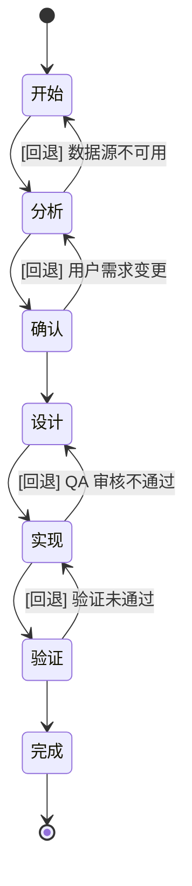
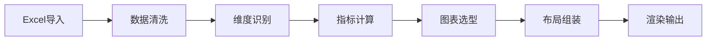

# conspect 核心工作流

## 状态机总览

conspect Skill 按以下状态机顺序执行，每个阶段产出物是下一阶段的前置条件。

## 数据处理流水线

数据处理遵循以下串行流水线，每个环节的产出物是下一环节的输入：

| 环节 | 说明 | 关键操作 |
|------|------|----------|
| Excel导入 | 多文件、多Sheet、多结构Excel批量导入 | 文件解析、Schema映射 |
| 数据清洗 | 空值处理、去重、类型纠正、异常值标记 | 缺失值填充、类型转换 |
| 维度识别 | 自动识别各字段的业务维度类型 | 时间/分类/排序/结构维度判定 |
| 指标计算 | 按维度聚合生成业务指标 | 合计、均值、同比、环比、占比 |
| 图表选型 | 根据数据特征匹配合适的图表类型 | 映射规则表匹配 |
| 布局组装 | 按商务排版规范组装图表 | 头部KPI→中部图表→底部结论 |
| 渲染输出 | 根据输出形态选择渲染方案 | Web看板/离线HTML/PDF截图 |

## 阶段定义表

| 阶段 | 执行者 | 前置条件 | 产出物 | 需QA审核 |
|------|--------|----------|--------|----------|
| 开始 | AI | 用户输入触发词 | 任务上下文记录 | 否 |
| 分析 | AI | 开始完成 | `_cs-analysis.md` 分析报告 | 是 |
| 确认 | 用户 | 分析报告生成 | 用户确认/修改意见 | 否 |
| 设计 | AI | 用户确认通过 | `_cs-design.md` 设计方案 | 是 |
| 实现 | AI | 设计方案QA通过 | 源码文件 + 运行结果 | 是 |
| 验证 | AI | 实现产物QA通过 | `_cs-verify.md` 验证报告 | 是 |
| 完成 | AI | 验证通过 | 交付产物 + 完成报告 | 否 |

## 阻断规则

- 前置产物不存在 → 阻断，回退到上一阶段重跑
- QA 审核未通过 → 阻断，根据审核意见修复后重审
- 同一阶段重试超过 2 次 → 标记为 FAILED，输出失败原因报告
- 用户取消 → 标记为 CANCELLED，清理临时文件

## 用户中断处理机制

1. **暂停**：用户可随时请求暂停当前流程，AI 保存中间状态到接力棒文件
2. **恢复**：读取接力棒，从断点处继续执行
3. **取消**：用户取消任务，清理所有临时产物
4. **变更需求**：用户提出需求变更后，跳转到"分析"阶段重新评估

## 状态流转约定

- 每个阶段完成后必须更新接力棒文件（`_cs-baton.md`）
- 每一步回复的第一行必须输出：`当前状态：[阶段名]，下一步：[操作]`
- 异常终止或用户中断时，接力棒状态标记为 `PAUSED` 或 `CANCELLED`
