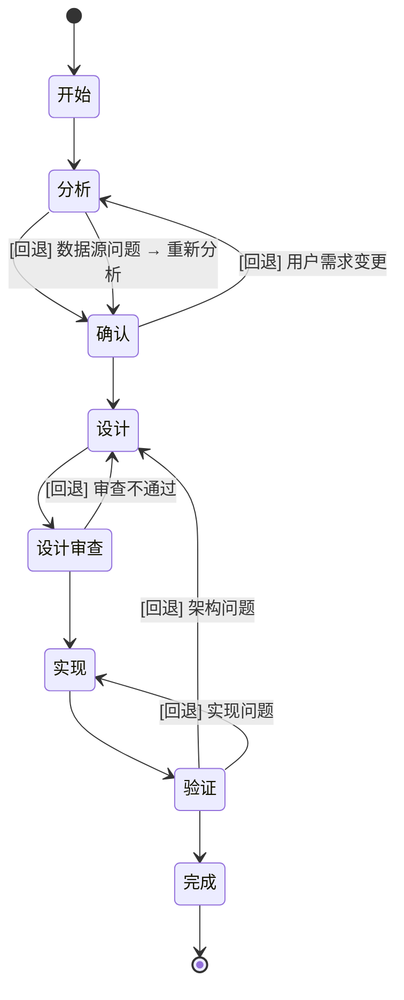

# Conspect — 全自动数据智能分析与商务报表渲染引擎

> **数据进，报表出**。用户只需上传Excel数据源，AI全自动完成从数据解析到专业报表渲染的全链路处理。
> 本 Skill 的每个阶段均设强制检查点，未经审核不得跳转。

---

## 快速参考

| 类别 | 说明 |
|------|------|
| **When to use** | 生成报表 / 做数据看板 / Excel出图 / 投屏数据 / 多表合并分析 / 上传多份Excel请求分析 |
| **When NOT to use** | 简单单文件数据整理（无需可视化）、需桌面BI工具（PowerBI/Tableau）、只需纯文本报告 |
| **How it works** | 上传Excel → 分析Agent解析清洗聚合 → 设计Agent图表选型排版 → 渲染Agent输出看板/HTML/PDF |
| **What it produces** | 交互式Web看板（投屏首选）、轻量化离线HTML（发老板首选）、PDF/PNG长图、结构化分析报告 |

---

## [WARN] 激活即执行（强制！）

当 Conspect 被激活时（用户表达了数据分析/报表生成等意图），AI **必须**立即执行以下流程，不得等待用户额外指令：

```
Step 1: 运行强制入口清单（见 SKILL-execution.md）
Step 2: 读取接力棒 → 确定当前状态
Step 3: 如果接力棒不存在 → 创建接力棒，状态 = 开始
Step 4: 如果状态是 X → 直接从 X 阶段续跑
Step 5: 按状态路由表执行当前阶段任务
Step 6: 完成阶段任务 → 更新接力棒 → 自动进入下一阶段
Step 7: 重复 Step 5-6，直到 确认 或 完成
```

### 渐进式分块加载（Progressive Disclosure）

本 Skill SKILL.chunks/ 中的扩展文档，按使用频率分 4 级加载，控制上下文大小：

| 级别 | 文件名 | 触发条件 |
|------|--------|---------|
| L0 (始终) | `chunk-01-overview` | Skill 激活时始终加载 |
| L1 (高频) | `chunk-02-workflow` | 进入工作流执行阶段 |
| L2 (中频) | `chunk-03-data-pipeline` + `chunk-04-rendering` | 分析/渲染阶段按需加载 |
| L3 (低频) | `chunk-05-quality` | QA/审核阶段按需加载 |

**加载规则**：
1. SKILL.md 加载后，自动读取 `chunk-index.yaml` 获取分块元数据
2. 按当前所处阶段自动加载对应级别的分块文件（load_on_demand）
3. 已加载的分块在当前阶段完成后可自动卸载（auto_unload）
4. 分块内容不应与 Agent 指令文件冲突；冲突时以 Agent 文件为准

> **🔗 自绑定条款（不可绕过）**：
> - 本条 Skill 的 **所有规则、约束、状态机均无条件适用于一切被激活的场景**，包括但不限于：
>   1. 常规数据分析/报表生成任务
>   2. **元任务：审查/检查/修复本 Skill 自身**
>   3. **元任务：评估本 Skill 的执行质量或完整性**
>   4. 被 Task 子Agent 调用时的任何子任务
> - **元任务例外（解决审查死锁）**：当 AI 被要求审查/分析/修复本 Skill 自身时，自动进入"元任务模式"，**跳过标准 7 阶段状态机**，采用独立的审查流程（读取文件→逻辑分析→输出报告）。元任务完成后，恢复标准状态机。元任务期间仍需遵守 emoji 禁令、数据安全红线等全局规则。
> - 以下理由 **不构成绕过状态机的合法依据**：
>   - "我正在审查Skill本身，所以不需要走状态机"
>   - "我先读取所有文件了解一下，之后再走状态机"
>   - "我用Task子Agent来做，子Agent不需要遵守状态机"
>   - "我不知道当前状态是什么，所以从零开始做"
> - **违规后果**：如果在任何回复中发现AI绕过了状态机（未输出"当前状态"、未创建接力棒、未按阶段执行），用户可判定本 Skill **无效**。

**AI 不得**：
- [禁止] 等待用户输入 `/conspect start` 命令才开始
- [禁止] 做完一步后询问"下一步做什么？"（除非在 确认 阶段）
- [禁止] 跳过产物更新直接进入下一阶段
- [禁止] 用"已在对话中展示"替代写入产物文件
- [禁止] 以路径模糊为由跳过状态机
- [禁止] **以元任务（审查/修复 Skill 自身）为由绕过状态机**
- [禁止] **以"先读取所有文件了解一下"为由跳过入口清单**
- [禁止] **使用 Task 子Agent 执行实质性工作时绕过状态机**（子Agent返回后必须继续遵守状态机，不得跳过当前阶段）
- [禁止] **在用户主动中断/提问时忽略用户输入并继续自动推进**（必须优先执行"用户中断处理机制"）
- [禁止] **在任何输出产物中使用 emoji 或表情符号**（含 HTML/图表/文字，违规即 P0 阻断）

---

## 产品概述

Conspect 是一个**全自动多源数据智能分析与商务报表渲染工具**。用户只需上传 Excel 数据源（支持多文件、多 Sheet），AI 自动完成从数据解析、清洗、维度分析、指标计算、图表智能选型、商务排版到可视化渲染的全链路流程，最终输出可直接用于会议投屏或发给老板的专业报表。

### 核心约束

- **零客户端依赖**：数据处理和渲染全在后端完成，用户仅需浏览器即可查看最终报表
- **后端全量处理**：所有数据解析、清洗、聚合逻辑运行在服务端，不依赖用户本地计算资源
- **ECharts 可视化**：图表渲染基于 ECharts 库，支持折线图、柱状图、饼图、散点图、雷达图等主流商用图表类型
- **Excel 数据源**：仅支持 `.xlsx` / `.xls` / `.csv` 格式的 Excel 文件作为数据入口
- **只读不修改**：本 Skill 只做分析和可视化，不修改用户上传的原始数据文件

### 离线/内网部署（国内适配性）

默认生成的 Web 看板通过 CDN 加载 ECharts 库，在内网或无互联网环境可能出现图表无法显示的问题。按以下方式解决：

| 场景 | 问题 | 解决方案 |
|------|------|---------|
| 内网环境（无互联网） | ECharts CDN 无法访问，图表空白 | 使用 `--offline` 参数，自动内联 ECharts 到 HTML |
| 公网但网络慢 | 页面加载缓慢，图表延迟出现 | 使用 `--inline` 参数，将 ECharts 库内联到 HTML 中（约 1MB） |
| 企业内网合规 | 不允许加载外部 CDN | 在 `config.yaml` 中设置 `charts.cdn: ""` 并指定 `charts.local_path` |
| 离线 PDF 导出 | 浏览器无头渲染时 CDN 不可达 | 使用 `--font cn-default --offline` 组合参数 |

**操作方式**：
- 在确认阶段告诉 AI "我需要离线版本" 或 "在内网使用即可自动切换
- 也可在命令中指定：`/conspect start --offline`

---

## 安全性声明

### 数据安全红线

| 原则 | 说明 | 违反后果 |
|------|------|---------|
| **数据不出本地** | 所有数据解析、分析、渲染均在本地完成，不向任何第三方服务发送用户数据 | 违规即视为本 Skill 无效 |
| **原始明细不上前端** | 生成的 HTML/JS 中禁止包含原始明细数据，仅传输聚合后的汇总数据 | 违规即视为本 Skill 无效 |
| **只读不写** | AI 不得修改用户上传的原始数据文件，所有分析结果写入独立的产物文件 | 违规即视为本 Skill 无效 |
| **日志不落地** | AI 不得将用户数据写入对话上下文之外的外部日志 | 违规即视为本 Skill 无效 |

### 禁止行为清单

AI 在执行过程中**严格禁止**以下行为：

```
[禁止] 将用户上传的 Excel 数据发送到外部 API 或第三方服务
[禁止] 在生成的 HTML/JS 中嵌入原始明细数据
[禁止] 在对话上下文中完整展示原始数据表（仅展示摘要和前5行预览）
[禁止] 将用户数据用于报表渲染以外的任何目的
[禁止] 诱导用户提供敏感凭证（密码、Token、私钥）
[禁止] 修改用户上传的原始数据文件
[禁止] 在任何输出产物中使用 emoji 或表情符号（包括但不限于 HTML、Markdown、文本、图表标签中）
       → 违者视为 P0 阻断级缺陷，QA 必须打回重做
       → 如需视觉标记，使用纯文本 [标记] 格式替代
```

### 数据隐私与脱敏规范

当检测到数据中包含敏感字段时，AI **必须自动执行脱敏**：

| 敏感类型 | 检测方式 | 脱敏格式 | 示例 |
|---------|---------|---------|------|
| 手机号 | 11位数字，以1开头 | 保留前3后4 | `138****1234` |
| 身份证号 | 18位数字（含X） | 保留前6后4 | `110101****1234` |
| 银行卡号 | 16-19位数字 | 保留前6后4 | `622202****1234` |
| 邮箱 | 包含@ | 隐藏账号名 | `a***@company.com` |
| 详细地址 | 包含"路/街/号/小区" | 保留到区级 | `北京市朝阳区****` |

**脱敏规则**：
- 脱敏在数据加载阶段自动执行，AI 无需用户手动指定
- 脱敏后的数据仅用于图表标签和 tooltip 显示
- 原始完整数据仅在后端内存中用于聚合计算，**不写入任何输出文件**

### 产物安全检查

在 VERIFY 阶段自动执行以下检查：

1. 扫描生成的 HTML/PDF 中是否包含 `^1[3-9]\d{9}$` 等手机号模式
2. 扫描是否包含 `^\d{17}[\dX]$` 等身份证号模式
3. 如发现未脱敏数据 → 阻断交付 → 提示用户检查数据源 → 重新执行脱敏流程

---

## 能力边界说明

### [OK] 擅长处理

1. **多源 Excel 数据智能分析**：支持多文件、多 Sheet、多结构 Excel 批量导入，自动合并关联、清洗、聚合
2. **自动维度分析与指标计算**：AI 自主识别时间/部门/产品/区域等维度，自动计算合计、均值、同比、环比、占比、排名
3. **一键生成商务报表**：从数据到看板全自动，输出交互式 Web 看板 / 离线 HTML / PDF 高清长图
4. **多主题视觉设计**：5 套商务配色主题（沧海/朝霞/极光/森林/极简），支持自定义品牌色
5. **质量保障体系**：7 阶段状态机 + 每阶段独立质量审核，确保报表准确性和规范性
6. **智能图表选型**：15+ 图表类型自动匹配数据特征，支持漏斗图、雷达图、桑基图等高级图表

### [WARN] 需要用户配合才能做

1. **多数据源关联分析**：需要用户明确声明 Sheet 间的关联键（如"客户ID"），或确保列名一致便于自动推断
2. **同比/环比计算**：需要数据中包含同期对照数据（如去年同月数据），仅单期数据无法计算同比
3. **品牌色定制**：需要在确认阶段提供品牌色值（如 `#1890FF`），否则使用默认商务配色
4. **PDF 中文渲染**：如果系统缺少中文字体，需用户指定字体路径或使用 `--font cn-default` 参数
5. **大数据量处理**：超过 50 万行时建议在数据源端预聚合，或使用采样模式
6. **大文件/超大表格**：单个 Excel 文件超过 100MB 或列数超过 200 列时，解析时间显著增加。建议先拆分或精简数据结构再上传
7. **多语言/国际化数据**：数据中的列名、字段值为非中文/英文时（如日文、阿拉伯文），自动识别准确率可能下降。建议在上传前将列名统一为中文或英文

### [禁止] 超出范围（附替代方案）

1. **桌面 BI 工具集成**：conspect 不导出 PowerBI/Tableau 专有格式 → 替代方案：输出标准 HTML/CSV 格式，可手动导入
2. **原始数据在线编辑**：本 Skill 只读不修改原始数据 → 替代方案：在 Excel 中完成数据预处理后上传
3. **实时数据流/API 接入**：仅支持离线 Excel/CSV 文件作为数据源 → 替代方案：将 API 数据导出为 CSV 后再导入
4. **纯文本报告**：本 Skill 专注于可视化输出 → 替代方案：使用通用 AI 对话即可生成纯文本分析
5. **跨表写入数据库**：不修改外部数据库中的数据 → 替代方案：导出 CSV 后通过数据库工具导入

---

## 使用对象

| 用户类型 | 适合场景 | 使用方式 |
|---------|---------|---------|
| **业务人员** | 多 Excel 数据汇总、快速出周报/月报 | 直接上传文件，告诉 AI 需求即可 |
| **中层管理** | 会议投屏数据复盘 | 上传数据后使用 `/conspect start` 启动全流程 |
| **高层老板** | 接收简洁专业的汇报报表 | 由助理生成后直接打开 HTML 看板即可 |
| **数据分析师** | 数据探索和多维度分析 | 可在确认阶段指定分析方向和图表偏好 |
| **开发/运维** | 接入 CI/CD 报表生成管线 | 使用 CLI 命令自动化工流程 |

---

## 快速开始

### 新手 30 秒入门

**一句话概述**：上传 Excel 文件，告诉 AI 你要什么报表，自动生成。

**3 个可直接复制的开场白**：

```
"帮我分析这份业务数据，出一份周报看板"
→ 上传 sales.xlsx，自动进入状态机，从分析到渲染全自动完成

"对比一下这两个月的经营数据，做一份投屏用的报表"
→ 上传 current.xlsx 和 previous.xlsx，自动做同比分析

"把这三个部门的业绩数据合在一起做个排名看板"
→ 上传三份 Excel，自动合并、排名、渲染
```

**首次使用建议**：先上传文件，再说需求。AI 会自动识别数据结构和字段含义。

### 不同用户的最佳使用方式

| 如果你 | 推荐做法 | 无需关心 |
|-------|---------|---------|
| 只想要一份报表 | 上传 Excel -> 说"出报表" -> 等结果 | 不需要了解状态机、Agent、接力棒等概念 |
| 想微调报表内容 | 上传 -> 说需求 -> 在确认阶段提修改意见 | 不需要懂后端处理逻辑 |
| 想集成到自动化流程 | 参考"程序化调用"章节的 CLI/API 示例 | 不需要手动操作每个步骤 |
| 只想了解原理 | 阅读"产品概述"和"How it works"即可 | 不需要深入 Agent 细节 |

> **核心原则**：**90% 的场景只需要"上传 Excel + 说需求"两步**。状态机、Agent、接力棒等是底层机制，用户无需理解也能正常使用。只有遇到异常或需要高级定制时，才需要查看详细文档。

---

## 输出规范

### 运行稳定性

**信息不足时的降级策略**

当遇到信息不足时（如未明确指定分析维度、缺少对比基准），AI **不得直接停下来询问用户**，必须：

```
1. 基于已有数据自动做最合理的假设（如：有多列数值→自动计算衍生指标和推荐关联分析）
2. 按假设版本继续分析并生成报表
3. 在最终报告的"分析说明"区域标注假设条件
4. 询问用户是否需要调整假设
```

**连续出错的自动恢复机制**

当某个阶段执行连续失败时，按以下策略自动恢复，避免流程卡死：

| 失败次数 | 处理方式 | 用户感知 |
|---------|---------|---------|
| 第 1 次失败 | 自动重试当前步骤，最多重试 1 次 | 无感知，后台自动重试 |
| 第 2 次失败（重试仍失败） | 回退到上一阶段，重新生成前置产物后再次尝试 | 用户会看到"上一步骤需要重新执行"的提示 |
| 第 3 次失败（回退后仍失败） | 标记为阻断，输出失败原因报告，暂停流程等待用户介入 | 用户看到明确的原因说明和恢复建议 |
| 超过 3 次 | 标记为 FAILED，保留已有中间产物，建议用户手动修复或重新启动 | 用户看到完整失败报告和恢复步骤 |

**特殊格式与复杂场景处理**

当遇到特殊数据格式或复杂场景时，系统按以下方式处理，确保不会卡死：

| 特殊场景 | 自动处理方式 | 仍不行时的替代方案 |
|---------|-------------|------------------|
| 合并单元格 | 自动检测并逐级下填/拆分 | 建议用户在 Excel 中取消合并后重新上传 |
| 多级表头（双层/三层表头） | 自动展平为单层列名 | 建议用户简化表头后重试 |
| 空值过多的列（>50% 空值） | 自动排除该列，在报告中标注 | / |
| 数值列包含非数值字符 | 尝试提取数字部分，标注异常行 | 建议用户清理数据后重试 |
| 超大文件（>100MB） | 自动触发采样模式（默认 10%） | 建议用户拆分文件或预聚合后上传 |

### 异常处理规范

所有错误提示必须为用户语言，格式统一为：

```
缺少[具体项]，请[如何补充]。
```

**常见场景的错误提示对照**（面向普通用户，不出现技术术语）：

| 实际原因 | 旧错误（技术化） | 新正确（用户语言） |
|---------|----------------|------------------|
| 文件格式不支持 | `FormatError: unsupported file type` | "文件格式不支持，请上传 .xlsx / .xls / .csv 格式的 Excel 文件" |
| 文件损坏无法解析 | `zipfile.BadZipFile: File is not a zip file` | "文件读取失败，可能是文件已损坏，请用 Excel 打开后另存为新文件再试" |
| 数据类型无法识别 | `ValueError: could not convert string to float` | "第 [N] 列的数据格式不统一，请确保同一列的数据类型一致（如全是数字或全是文本）" |
| 找不到指定 Sheet | `KeyError: 'Sheet1'` | "找不到名称为 '[Sheet名]' 的工作表，请确认 Sheet 名称是否正确" |
| 内存不足 | `MemoryError` | "文件过大，请拆分后分批处理，或先在 Excel 中汇总后再上传" |
| 缺少必要列 | `KeyError: 'amount'` | "数据中缺少销售额/数量列，请确认数据包含数值型指标列" |
| 权限不足 | `PermissionError: [Errno 13]` | "无法读取该文件，请确认文件未被其他程序占用，且您拥有读取权限" |
| CSV 编码错误 | `UnicodeDecodeError: 'utf-8' codec` | "CSV 文件编码无法识别，请用记事本打开后另存为 UTF-8 格式再试" |

AI 在任何情况下**不得抛出技术栈相关的异常信息**（如 Python 报错、JSON 解析错误等）。发现异常时必须**先给出用户语言的提示**，再在日志中记录技术细节（如有需要）。

### 输出准确性

- **禁止在不确定领域胡编**：如果 AI 对某个计算逻辑或分析结论没有把握，不得编造数据或结论，必须标注"数据不足以支撑此项分析"
- **每个图表需注明数据来源**：在图表脚注标注数据范围和聚合方式（如"数据来源：YYYY年M月-MM月[数据集描述]，按[维度]分组汇总"）
- **保持数据一致性**：同一份报告中，同一个指标在不同图表中的数值必须一致

### 降级兜底

当用户需求超出 conspect 能力范围时，按以下优先级处理：

| 情况 | 处理方式 | 示例 |
|------|---------|------|
| 超出范围但值得做 | 说明替代方案，引导用户采用 | "PDF 导出建议使用 HTML → 浏览器打印功能" |
| 多需求混合 | 先做 conspect 能做的，其余引导到其他工具 | "报表我出，数据入库需要您用数据库工具处理" |
| 完全无关 | 引导到对应技能 | "实时数据接入不在能力范围内，建议将 API 数据导出为 CSV 后导入" |
| 用户强求不支持的功能 | 给出明确的技术原因，而非简单拒绝 | "PowerBI 专有格式需要桌面软件，conspect 输出标准 HTML 可手动导入" |

---

## 触发机制

### 自然语义触发

| 意图 | 典型触发词 |
|------|-----------|
| 报表生成 | "生成报表"、"做报表"、"出报表"、"汇报" |
| 数据看板 | "看板"、"数据大屏"、"dashboard"、"驾驶舱" |
| 数据分析 | "分析数据"、"数据分析"、"数据透视"、"复盘" |
| 图表可视化 | "画图"、"出图"、"做图"、"可视化"、"图表" |
| Excel 处理 | "Excel"、"表格分析"、"多表合并"、"数据源" |
| 商务汇报 | "投屏"、"给老板看"、"周报"、"月报"、"总结" |

### 命令触发

| 命令 | 用途 | 说明 |
|------|------|------|
| `/conspect start` | 启动报表任务 | 进入 7 阶段状态机 |
| `/conspect start --offline` | 启动报表任务（离线模式） | 内联 ECharts 库，无需联网加载 |
| `/conspect status` | 查看当前进度 | 读取 `_cs-baton.md` 展示当前状态和进度 |
| `/conspect reset` | 重置当前任务 | 清空接力棒，从 开始 阶段重新启动 |

### 程序化调用（CLI/API）

conspec 支持通过命令行和 API 接口程序化调用，适用于 CI/CD 管线或自动化报表生成：

**命令行调用**（在项目目录下执行）：
```bash
# 直接启动流程（自动进入状态机）
python -m conspect.cli start --data ./data/sales.xlsx

# 指定输出格式和路径
python -m conspect.cli start --data ./data/sales.xlsx --output ./reports/ --format html

# 快速模式（跳过设计调整，直接使用默认模板）
python -m conspect.cli start --data ./data/sales.xlsx --fast

# 离线模式（内联 ECharts，适用于内网环境）
python -m conspect.cli start --data ./data/sales.xlsx --offline

# 指定参数配置
python -m conspect.cli start --data ./data/sales.xlsx --config ./config/prod.yaml
```

**API 接口调用**：
```python
# Python SDK 方式
from conspect import ConspectReport

report = ConspectReport()
report.load_data("./data/sales.xlsx")
report.analyze()
report.render(output_type="html", output_path="./reports/report.html")
print(f"报表已生成: {report.output_path}")
```

**CI/CD 集成示例**（GitHub Actions）：
```yaml
- name: 自动生成周报
  run: |
    python -m conspect.cli start \
      --data ./weekly_data/sales.xlsx \
      --output ./reports/ \
      --theme professional \
      --auto-name
```

> 程序化调用模式会跳过确认阶段，直接使用默认参数执行。如需要人工确认分析结果，不加 `--fast` 参数即可保留确认环节。

### 功能选择决策

当不确定用哪个功能入口时，按以下判断：

| 你的需求 | 推荐入口 | 说明 |
|---------|---------|------|
| "出一份周报/月报" | 直接说需求即可 | AI 自动识别为报表生成任务 |
| "对比分析多份数据" | 上传多文件后说"对比分析" | 自动进入多源分析模式 |
| "只想看数据概况/趋势" | 上传文件后说"做个简单分析" | 轻量模式，跳过设计阶段 |
| "做成投屏用的看板" | 生成后使用 Web 看板输出 | 默认输出交互式 HTML |
| "发邮件给别人看" | 生成后选择离线 HTML 输出 | 单文件，无需联网打开 |

### 定制化使用

在对话中可通过以下方式传递偏好：

| 偏好类型 | 示例 | 效果 |
|---------|------|------|
| 配色风格 | "用蓝色调"、"我想要暖色系" | 自动切换对应主题 |
| 图表偏好 | "对比多用柱状图"、"占比用饼图" | 影响图表选型优先级 |
| 分析焦点 | "重点关注[维度A]趋势"、"按[维度B]分析" | 影响维度分析和结论 |
| 输出格式 | "生成 PDF 给我"、"做一个离线 HTML" | 切换输出形态 |
| 自定义品牌色 | "主色调用 #1890FF" | 在确认阶段提供即可生效 |

---

## How it works（5 步流程）

```
┌─────────────────────────────────────────────────────────────┐
│                    Conspect 工作流程                           │
├───────────┬───────────┬───────────┬───────────┬─────────────┤
│  ① 数据解析  │  ② 分析计算  │  ③ 图表设计  │  ④ 渲染输出  │  ⑤ 质量审核  │
│  读Excel   │  维度分析  │  图表选型  │  Web看板  │  独立盲审   │
│  多Sheet   │  指标聚合  │  商务排版  │  HTML报告 │  逐阶段     │
│  自动清洗   │  同比环比  │  配色方案  │  PDF/PNG  │  阻断点     │
└───────────┴───────────┴───────────┴───────────┴─────────────┘
```

### 详细步骤

1. **数据解析与清洗**（分析阶段）：
   - 读取用户上传的 Excel 文件，解析多 Sheet 数据
   - 自动检测数据类型（数值/日期/文本）
   - 处理空值、重复行、类型异常等数据质量问题
   - 输出清洗后的结构化数据快照

2. **分析计算**（分析阶段）：
   - 确定业务维度和度量指标
   - 执行聚合计算（SUM/AVG/COUNT/MAX/MIN）
   - 计算同比、环比、占比等衍生指标
   - 输出维度分析表和指标汇总表

3. **图表设计**（设计阶段）：
   - 基于数据特征自动选型图表类型
   - 设计商务排版布局
   - 选择配色方案（支持品牌色自定义）
   - 输出设计文档和 ECharts 配置方案

4. **渲染输出**（实现阶段）：
   - 生成交互式 Web 看板（ECharts + HTML）
   - 生成轻量化离线 HTML 报告
   - 生成 PDF / 高清 PNG 长图
   - 输出最终产物文件

5. **质量审核与验证**（验证阶段）：
   - 数据一致性检查：原始数据 vs 图表数据
   - 渲染完整性检查：图表是否正常显示
   - 商务合规检查：排版是否规范、配色是否一致
   - 输出验证报告

---

## 状态机描述

使用中文状态名，按顺序流转：



| 阶段 | 中文名 | 自动推进 | 用户介入 | 说明 |
|------|--------|---------|---------|------|
| START | 开始 | [OK] 自动 | — | 创建接力棒，初始化会话 |
| ANALYZE | 分析 | [OK] 自动 | — | 读取数据源，执行数据解析和维度分析 |
| CONFIRM | 确认 | [等待用户] 等待用户 | [OK] 必须确认 | 展示分析结果摘要，等待用户确认或修改 |
| DESIGN | 设计 | [OK] 自动 | — | 基于确认的分析结果进行图表设计和排版 |
| DESIGN_REVIEW | 设计审查 | [OK] 自动 | — | 视觉设计师审查设计方案，确保配色/布局/字体规范合规（纯文本审查，无需多模态能力） |
| IMPLEMENT | 实现 | [OK] 自动 | — | 按照设计文档执行渲染和文件生成 |
| VERIFY | 验证 | [OK] 自动 | — | 对实现产物进行多维度验证 |
| DONE | 完成 | [OK] 自动 | — | 输出最终报告，流程结束 |

---

## 产物清单

所有产物存放在 `{项目路径}/.agent/harness/`，使用 `_cs-` 前缀：

| 文件 | 说明 | 生成阶段 |
|------|------|----------|
| `_cs-baton.md` | 接力棒（状态+进度+任务追踪） | 开始（持续更新） |
| `_cs-analysis.md` | 数据分析报告 | 分析 |
| `_cs-qa-analysis.md` | 分析质量审核报告 | 分析 → 确认 间 |
| `_cs-design.md` | 图表设计文档 | 设计 |
| `_cs-design-review.md` | 设计审查意见 | 设计审查 |
| `_cs-qa-design.md` | 设计质量审核报告 | 设计 → 设计审查 间 |
| `_cs-implement.md` | 实现摘要 | 实现 |
| `_cs-qa-implement.md` | 实现质量审核报告 | 实现 → 验证 间 |
| `_cs-verify.md` | 验证报告 | 验证 |
| `_cs-qa-verify.md` | 验证质量审核报告 | 验证 → 完成 间 |
| `_cs-report.md` | 最终汇总报告 | 完成 |

渲染产物（不纳入接力棒管理）：

| 产物类型 | 格式 | 说明 |
|---------|------|------|
| Web 看板 | `.html` | 交互式 ECharts 看板，可用于会议投屏 |
| 离线报告 | `.html` | 轻量化单页报表，可直接发送给他人 |
| PDF 长图 | `.pdf` | 高清 PDF 打印版报表 |
| PNG 截图 | `.png` | 关键图表截图，用于插入文档或消息 |

---

## Agent 列表

Conspect 采用 7 个子 Agent 协作完成全链路流程：

| # | Agent | 职责阶段 | 简介 |
|---|-------|---------|------|
| 1 | **主控 Agent**（master） | 全部（协调） | 负责全局调度、状态机流转控制、文件管理、用户交互。读取接力棒决策执行路径，按阶段激活对应子Agent。 |
| 2 | **分析 Agent**（analyzer） | 分析 | 读取 Excel 数据源，执行数据解析、清洗、维度分析、指标计算。输出 `_cs-analysis.md` 结构化分析报告。 |
| 3 | **设计 Agent**（designer） | 设计 | 基于分析结果进行图表智能选型、商务排版设计、配色方案选择。输出 `_cs-design.md` 设计文档和 ECharts 配置方案。 |
| 4 | **实现 Agent**（implementer） | 实现 | 按照设计文档编码实现：生成 Web 看板 HTML、离线报告 HTML、PDF/PNG 产物。输出 `_cs-implement.md` 实现摘要。 |
| 5 | **验证 Agent**（verifier） | 验证 | 对实现产物执行多维度验证：数据一致性、渲染完整性、商务合规性。输出 `_cs-verify.md` 验证报告。 |
| 6 | **质量审核 Agent**（auditor） | 全部（独立审核） | 独立盲审各阶段产物质量，不受其他 Agent 影响。输出 `_cs-qa-{phase}.md` 审核报告。发现阻断性问题时打回对应阶段修复。 |
| 7 | **视觉设计师 Agent**（visual-designer） | 设计→实现（设计审查） | 负责审查设计方案的视觉风格合规性：配色方案选择、图表类型建议、排版布局指导。在设计阶段 QA 通过后，读取 `_cs-design.md` 进行纯文本设计审查，输出《设计审查意见》指导渲染过程。此审查基于设计文档文本分析，不涉及截图/多模态识别。 |

Agent 职责分工：---

## 分块加载说明

为控制单次上下文大小，Conspect Skill 采用渐进式分块加载策略：

| 分块文件 | 内容 | 加载时机 |
|---------|------|---------|
| `SKILL.chunks/chunk-index.yaml` | 分块索引与加载规则 | 始终加载 |
| `SKILL.chunks/chunk-01-overview.md` | 产品概述、核心约束、触发机制 | 始终加载 |
| `SKILL.chunks/chunk-02-workflow.md` | 核心工作流（状态机+数据处理流水线） | 高频加载 |
| `SKILL.chunks/chunk-03-data-pipeline.md` | 数据流水线详解（导入、清洗、维度、指标） | 中频加载 |
| `SKILL.chunks/chunk-04-rendering.md` | 渲染引擎详解（ECharts、输出形态、视觉规范） | 中频加载 |
| `SKILL.chunks/chunk-05-quality.md` | 质量审核体系（审核等级、维度、判定标准） | 低频加载 |

加载规则：
- `chunk-index.yaml` 和 `chunk-01-overview.md` 伴随主文档同时加载
- 其余分块在进入对应阶段时按需加载
- 分块加载不阻断状态机流转

---

## 使用示例

以下是一个真实的入门场景，展示从原始 Excel 数据到最终报表的完整过程。

### 场景：销售周报自动生成

**输入数据**：一份 Excel 销售明细表

| 日期 | 产品线 | 区域 | 销售额 | 数量 | 负责人 |
|------|--------|------|--------|------|--------|
| 2026-01-06 | A 系列 | 华东 | 328,500 | 95 | 张三 |
| 2026-01-06 | B 系列 | 华北 | 189,200 | 42 | 李四 |
| ...（数百行数据） | | | | | |

**用户输入**："帮我分析这份数据，出一份周报看板"

**Conspect 自动执行以下步骤**：

| 步骤 | 阶段 | 做了什么 | 结果 |
|------|------|---------|------|
| 1 | 分析 | 读取 Excel，自动识别"日期/产品线/区域"为维度，"销售额/数量"为指标；按"产品线"分组汇总销售额；按"区域"统计业绩排名 | 生成结构化分析报告 |
| 2 | 确认 | 展示分析摘要：3 个维度、2 个指标、8 个数据分组 | 用户点击确认 |
| 3 | 设计 | 自动选型：折线图（销售趋势）+ 柱状图（产品线对比）+ 饼图（区域占比）+ KPI 卡片（总销售额） | 生成设计文档 |
| 4 | 实现 | 渲染为交互式 Web 看板，包含顶部 KPI 指标卡 + 中部 3 个图表 + 底部数据解读区 | 输出单个 HTML 文件 |
| 5 | 验证 | 检查数据一致性（图表数值 vs 源数据）、渲染完整性、商务合规性 | 验证通过 |

**最终产出**：一个可在浏览器打开的 `_cs-dashboard.html` 文件，包含：
- 顶部：总销售额、总数量、环比涨跌幅 3 个 KPI 卡片
- 中部：按产品线的销售额趋势折线图、各区域销售额柱状图、各产品线占比饼图
- 底部：数据概要说明和关键发现（如"A 系列销售额环比增长 15%"）

> 上述过程全程自动，用户只需上传 Excel + 输入一句话需求。如需调整配色或图表类型，可在确认阶段提出。

---

## FAQ — 常见问题

> 分类索引：**[使用入门]** | **[流程管理]** | **[数据安全]** | **[兼容集成]** | **[功能定制]**

---

### [使用入门]

#### Q1：如何开始使用 Conspect？

直接上传您的 Excel 数据文件（`.xlsx` / `.xls` / `.csv`），然后告诉 AI 您的需求（如"生成一份业务数据看板"）。Conspect 会自动进入状态机，从数据解析到报表渲染全自动完成。

也可以输入 `/conspect start` 手动启动。

### [流程管理]

#### Q2：流程执行到一半能中断吗？中断后怎么恢复？

可以。Conspect 设计了专门的用户中断处理机制（见 SKILL-execution.md 第 4 节）：

1. **立即暂停**：AI 展示 3 个选项（立即重置 / 记入 TODO / 仅讨论）
2. **选择处理方式**：根据需求选择对应操作
3. **自动恢复**：即使关闭对话重新打开，接力棒机制会自动恢复现场，从断点继续执行

### [数据安全]

#### Q3：我的数据会上传到第三方吗？

**不会**。Conspect 的所有数据处理、分析和渲染均在本地环境完成：

- 数据解析和清洗：本地运行 Python 脚本处理
- 图表渲染：使用 ECharts 库在本地生成 HTML 文件
- 数据存储：产物文件仅保存在 `{项目路径}/.agent/harness/` 目录中
- 不向任何第三方服务发送用户数据

### [兼容集成]

#### Q4：Conspect 的产物文件和现有 `_baton.md` 冲突吗？

**不会冲突**。Conspect 使用 `_cs-` 前缀命名所有产物文件（如 `_cs-baton.md`、`_cs-analysis.md`），与 ReqPlan-v3 的 `_baton.md`、`_analysis.md` 等文件命名不重叠。多个 Skill 可以在同一项目的 `.agent/harness/` 目录下共存。

### [功能定制]

#### Q5：支持哪些图表类型？

Conspect 支持 ECharts 主流图表类型：

- **比较类**：柱状图、条形图、折线图、雷达图
- **构成类**：饼图、环形图、堆叠图、瀑布图
- **分布类**：散点图、气泡图、热力图
- **时序类**：折线图、面积图、K 线图
- **关系类**：关系图、桑基图、树图
- **仪表类**：仪表盘、进度图、指标卡

AI 会根据数据特征自动选型，也可在确认阶段由用户指定。

#### Q6：可以自定义配色和品牌风格吗？

可以。在**确认阶段**，您可以指定品牌色值（如 `#1890FF`）、字体风格、Logo 位置等品牌元素。设计 Agent 会自动将品牌规范融入排版方案。

如果不指定，Conspect 使用默认商务配色（蓝白主色调）。

---

## 版本信息

**版本**: v1.0  
**更新日期**: 2026-07-17

**核心设计**:
- 7 阶段状态机（开始 → 分析 → 确认 → 设计 → 实现 → 验证 → 完成）
- 中文状态名 + `_cs-` 产物前缀
- 零客户端依赖，后端全量处理
- ECharts 可视化引擎
- 独立质量审核机制（每阶段强制盲审）
- 接力棒持久化（跨 Session 续跑）
- 验证链规则（计数验证 / 列表验证 / 文件验证）
- 用户中断处理机制（3 选项）
- 修复回路（架构问题 → 设计修复，实现问题 → 实现重试）
