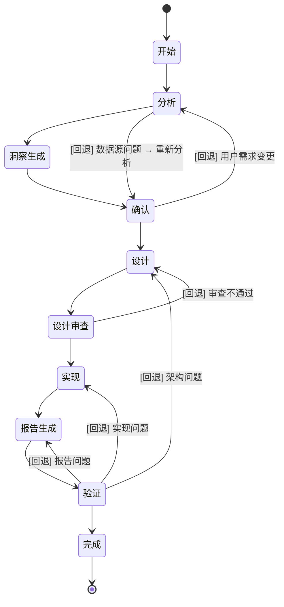

# Conspect — 全自动数据智能分析与商务报表渲染引擎

> **数据进，报表出**。用户只需上传Excel数据源，AI全自动完成从数据解析到专业报表渲染的全链路处理。
> 本 Skill 的每个阶段均设强制检查点，未经审核不得跳转。

---

## 快速参考

| 类别 | 说明 |
|------|------|
| **When to use** | 生成报表 / 做数据看板 / Excel出图 / 投屏数据 / 多表合并分析 / 上传多份Excel请求分析 |
| **When NOT to use** | 简单单文件数据整理（无需可视化）、需桌面BI工具（PowerBI/Tableau）、只需纯文本报告 |
| **How it works** | 上传Excel → 分析Agent解析清洗聚合 → 设计Agent图表选型排版 → 渲染Agent输出看板/HTML/PDF + 分析报告(MD/HTML/PDF/Word) |
| **What it produces** | 交互式Web看板（投屏首选）、轻量化离线HTML（发老板首选）、PDF/PNG长图、结构化分析报告（含中文命名副本） |

---

## [WARN] 激活即执行（强制！）

当 Conspect 被激活时（用户表达了数据分析/报表生成等意图），AI **必须**立即执行以下流程，不得等待用户额外指令：

```
Step 1: 运行强制入口清单（见 SKILL-execution.md）
Step 2: 读取接力棒 → 确定当前状态
Step 3: 如果接力棒不存在 → 创建接力棒，状态 = 开始
Step 4: 如果状态是 X → 直接从 X 阶段续跑
Step 5: 按状态路由表执行当前阶段任务
Step 6: 完成阶段任务 → 更新接力棒 → 自动进入下一阶段
Step 7: 重复 Step 5-6，直到 确认 或 完成
```

### 渐进式分块加载（Progressive Disclosure）

本 Skill 采用渐进式分块加载策略，控制上下文大小：

| 级别 | 文件名 | 触发条件 |
|------|--------|---------|
| L0 (始终) | `chunk-01-overview` | Skill 激活时始终加载 |
| L1 (高频) | `chunk-02-workflow` | 进入工作流执行阶段 |
| L2 (中频) | `chunk-03-data-pipeline` + `chunk-04-rendering` | 分析/渲染阶段按需加载 |
| L3 (低频) | `chunk-05-quality` | QA/审核阶段按需加载 |
| L2 (中频) | `references/output-spec` | 输出规范阶段按需加载 |
| L2 (中频) | `references/trigger-guide` | 触发机制阶段按需加载 |
| L3 (低频) | `references/examples` | 使用示例阶段按需加载 |
| L3 (低频) | `references/quality-audit` | 质量审核阶段按需加载 |
| L3 (低频) | `references/ai-reviewer` | AI审核阶段按需加载 |
| L2 (中频) | `references/cli-ai-workflow` | CLI/AI协作阶段按需加载 |
| L3 (低频) | `references/agent-communication` | Agent通信阶段按需加载 |
| L3 (低频) | `references/chart-selection` | 图表选型阶段按需加载 |

**加载规则**：
1. SKILL.md 加载后，自动读取 `chunk-index.yaml` 获取分块元数据
2. 按当前所处阶段自动加载对应级别的分块文件（load_on_demand）
3. 已加载的分块在当前阶段完成后可自动卸载（auto_unload）
4. 分块内容不应与 Agent 指令文件冲突；冲突时以 Agent 文件为准

> **自绑定条款（不可绕过）**：
> - 本条 Skill 的 **所有规则、约束、状态机均无条件适用于一切被激活的场景**，包括但不限于：
>   1. 常规数据分析/报表生成任务
>   2. **元任务：审查/检查/修复本 Skill 自身**
>   3. **元任务：评估本 Skill 的执行质量或完整性**
>   4. 被 Task 子Agent 调用时的任何子任务
> - **元任务例外（解决审查死锁）**：当 AI 被要求审查/分析/修复本 Skill 自身时，自动进入"元任务模式"，**跳过标准 9 阶段状态机**，采用独立的审查流程（读取文件→逻辑分析→输出报告）。元任务完成后，恢复标准状态机。元任务期间仍需遵守 emoji 禁令、数据安全红线等全局规则。
> - 以下理由 **不构成绕过状态机的合法依据**：
>   - "我正在审查Skill本身，所以不需要走状态机"
>   - "我先读取所有文件了解一下，之后再走状态机"
>   - "我用Task子Agent来做，子Agent不需要遵守状态机"
>   - "我不知道当前状态是什么，所以从零开始做"
> - **违规后果**：如果在任何回复中发现AI绕过了状态机（未输出"当前状态"、未创建接力棒、未按阶段执行），用户可判定本 Skill **无效**。

**AI 不得**：
- [禁止] 等待用户输入 `/conspect start` 命令才开始
- [禁止] 做完一步后询问"下一步做什么？"（除非在 确认 阶段）
- [禁止] 跳过产物更新直接进入下一阶段
- [禁止] 用"已在对话中展示"替代写入产物文件
- [禁止] 以路径模糊为由跳过状态机
- [禁止] **以元任务（审查/修复 Skill 自身）为由绕过状态机**
- [禁止] **以"先读取所有文件了解一下"为由跳过入口清单**
- [禁止] **使用 Task 子Agent 执行实质性工作时绕过状态机**（子Agent返回后必须继续遵守状态机，不得跳过当前阶段）
- [禁止] **在用户主动中断/提问时忽略用户输入并继续自动推进**（必须优先执行"用户中断处理机制"）
- [禁止] **使用 `python -c` 或 `python.exe -c` 执行内联 Python 代码**（Windows PowerShell 不支持内联代码，必须使用 CLI 工具层 `python run.py` 或写入脚本文件）
- [禁止] **CLI 命令失败后放弃 CLI，自行写 `python -c` 内联代码替代**（必须先定位 CLI_DIR，按"CLI 调用失败时的处理流程"重试，仍失败则写 .py 脚本文件而非 -c 内联）
- [禁止] **在 PowerShell 单引号字符串中对双引号加反斜杠转义**（即用 `'{\"key\": \"value\"}'` 代替 `'{"key": "value"}'`，这会导致 JSON 解析失败）
- [禁止] **在任何输出产物中使用 emoji 或表情符号**（含 HTML/图表/文字，违规即 P0 阻断）

---

## CLI 工具层速查表（激活即加载）

> 本 Skill 所有数据操作**必须**通过 CLI 工具层执行。以下列表是你在各阶段需要用到的所有 CLI 命令。
> 如果你在某个阶段需要操作数据/加载文件/计算统计/交叉分析，**先查下表**，不要自己写 Python 代码。

### CLI 调用方式（修复 PowerShell 引号问题的终极方案）

CLI 工具 `run.py` 位于 Skill 安装目录下的 `conspect_tools/` 子目录中。调用时必须**先切换到该目录**，再执行。

#### 方案 A（推荐）：标准输入管道传递 JSON

**这是最推荐的调用方式**。PowerShell 单引号中的双引号是字面量，通过管道传给 `python run.py` 的标准输入，完全不存在引号转义问题。

```powershell
cd {CLI_DIR}
'{"file_paths": ["e:/skill_example/数据源文件.xlsx"]}' | python run.py analyze
```

**工作原理**：`'...'` 保持字符串原样 → `|` 管道传给 stdin → Python 的 `sys.stdin.read()` 直接读到有效 JSON。

#### 方案 B（备选）：`--params-file` 从文件读取

如果因管道不支持（如参数太长），先用 IDE 的 `Write` 工具创建 JSON 文件，然后 CLI 从文件读取：

```
步骤 1：用 IDE Write 工具创建 _params.json
  文件路径 = {CLI_DIR}/_params.json
  内容：{"file_paths": ["e:/数据源文件.xlsx"]}

步骤 2：切换到 CLI 目录，从文件读取参数执行
  cd {CLI_DIR}
  python run.py analyze --params-file _params.json
```

**注意**：必须用 IDE 的 `Write` 工具（不是终端的 PowerShell `write` 命令，那是 `Write-Output` 别名只打印不写文件）。

#### 方案 C（最后备用）：单引号内联 JSON

仅在无法使用管道和文件时使用：

```powershell
cd {CLI_DIR}
python run.py analyze '{"file_paths": ["e:/data.xlsx"]}'
```

**警告**：单引号内**不要**给双引号加反斜杠！
- [正确] `'{"key": "val"}'` → ✅
- [错误] `'{\"key\": \"val\"}'` → ❌ Invalid JSON

#### 路径调用规则

```powershell
# [正确] 先 cd 到 {CLI_DIR}
cd {CLI_DIR}
python run.py analyze --params-file _params.json

# [错误] 不要两个路径参数都用引号并列
"python.exe" "run.py" analyze '{...}'  # PowerShell ParserError ❌
```

**Skill 安装目录自动定位规则**（AI 必须执行）：

```
1. 使用 Glob 全局搜索 run.py（最可靠，能找到所有副本）：
   glob **/conspect_tools/run.py
   
2. 搜索结果可能有多个（开发目录 + 系统目录），**优先选择：
   - 不在 c:\Users\{user}\.trae-cn\ 路径下的（系统目录代码可能不是最新版）
   - 在 e:\ 或项目所在盘符下的
   
3. 如果只有系统目录可用（c:\Users\{user}\.trae-cn\...），也可以使用
   但确认没有其他路径选择

4. 定位到后，记下该目录路径作为 {CLI_DIR}
5. 验证方式：ls {CLI_DIR}/run.py 确认文件存在
6. 后续所有 CLI 调用统一使用：
   cd {CLI_DIR}
   python run.py <action> '<json_params>'
```

### 命令速查表

| 动作 | 命令格式 | 使用阶段 | 用途 |
|------|---------|---------|------|
| **analyze** | `python run.py analyze '{"file_paths": [...]}'` | 分析 | 全链路分析（加载→清洗→维度识别→聚合→统计→质量评分） |
| **load** | `python run.py load '{"file_paths": [...]}'` | 分析 | 仅加载数据，返回 Sheet 列表 |
| **read_all** | `python run.py read_all '{"file_paths": [...]}'` | 分析 | 返回原始结构信息（列名/类型/样本） |
| **cross_tabulate** | `python run.py cross_tabulate '{"file_paths": [...], "row_dim": "...", "col_dim": "..."}'` | 分析 | 任意两维度交叉聚合 |
| **quality_assess** | `python run.py quality_assess '{"file_paths": [...]}'` | 分析 | 按列数据质量评分 |
| **compare_data** | `python run.py compare_data '{"data1": {...}, "data2": {...}}'` | 分析/审核 | 两数据集一致性比较 |
| **extract_features** | `python run.py extract_features '{"data": {...}}'` | 分析/设计 | 提取数据特征 |
| **calc_statistics** | `python run.py calc_statistics '{"values": [...]}'` | 分析/洞察 | 计算统计数据 |
| **ai_decide_chart** | `python run.py ai_decide_chart '{"features": {...}}'` | 设计 | AI Agent 图表选型 |
| **ai_generate_insights** | `python run.py ai_generate_insights '{"statistics": {...}}'` | 洞察 | AI Agent 生成洞察 |
| **render_report** | `python run.py render_report '{"report_design": {...}}'` | 报告 | 渲染报告（MD/HTML/PDF/Word） |
| **save_report** | `python run.py save_report '{"content": "...", "filename": "..."}'` | 报告 | 保存产物文件 |
| **save_with_chinese_name** | `python run.py save_with_chinese_name '{"content": "...", "filename": "..."}'` | 报告 | 保存并生成中文命名副本 |

### CLI 调用失败时的处理流程（强制！不遵守视为违规）

```markdown
[P0 阻断] 如果 CLI 命令执行失败（ParserError/路径错误等），AI 不得自行写 Python 代码替代！

[正确] 失败处理流程：
1. 确认 {CLI_DIR} 路径是否正确（重新搜索 run.py）
2. 确认是否先 cd 到了 {CLI_DIR}
3. **改用标准输入管道方式重试（最可靠）**：
   ```powershell
   cd {CLI_DIR}
   '{"file_paths": ["e:/数据源文件.xlsx"]}' | python run.py analyze
   ```
4. 如果管道成功，继续执行；后续所有调用都使用此方式
5. 如果管道失败，改用 --params-file 方式
6. 如果仍失败，将 Python 逻辑写入 .py 文件执行（而非 -c 内联）

[错误] 失败后的错误做法：
- ❌ 放弃 CLI，直接用 python -c "import pandas as pd; ..."
- ❌ 说"CLI 不能用，所以我自己写代码分析"
- ❌ 说"PowerShell 不支持，改用脚本方式"
```

> **白名单例外**：唯一允许 AI 写脚本文件的情况是 CLI 中确实没有对应动作（如自定义数据透视），且必须先写入 `.py` 文件再执行。即使写脚本，也不能使用 `-c` 内联方式。

---

## 核心约束

### 技术约束

- **零客户端依赖**：数据处理和渲染全在后端完成，用户仅需浏览器即可查看最终报表
- **后端全量处理**：所有数据解析、清洗、聚合逻辑运行在服务端，不依赖用户本地计算资源
- **ECharts 可视化**：图表渲染基于 ECharts 库，支持折线图、柱状图、饼图、散点图、雷达图等主流商用图表类型
- **Excel 数据源**：仅支持 `.xlsx` / `.xls` / `.csv` 格式的 Excel 文件作为数据入口
- **只读不修改**：本 Skill 只做分析和可视化，不修改用户上传的原始数据文件

### 执行约束（强制！）

当 Conspect 被激活时，AI **必须**读取 `SKILL-execution.md` 获取当前阶段的详细执行步骤。

**禁止**：
- 跳过 SKILL-execution.md 直接执行
- 仅凭 SKILL.md 中的简要描述执行
- 省略任何步骤（如审核、中文命名等）

### 禁止内联 Python 代码（强制！）

AI **禁止**使用 `python -c "..."` 或 `python.exe -c "..."` 方式在 PowerShell 中执行内联 Python 代码，因为 Windows PowerShell 不支持内联 Python 代码（引号嵌套会导致 ParserError）。

**正确方式**：所有数据加载、分析和计算操作必须使用 CLI 工具层：
```bash
python run.py analyze '{"file_paths": ["文件.xlsx"]}'
python run.py load '{"file_paths": ["文件.xlsx"]}'
python run.py extract_features '{"data": {...}}'
python run.py calc_statistics '{"values": [...]}'
```

**如果需要执行自定义 Python 逻辑**：先写入 `.py` 脚本文件，再执行脚本：

### 产物缺失阻断（强制！）

每个阶段结束后，AI **必须**检查所有应该生成的文件是否已生成。

**如果产物缺失 → 阻断 → 必须补充生成**

#### 报告生成阶段必须生成的文件
- `_cs-report.md`（Markdown 报告）
- `_cs-report.html`（HTML 报告）
- `_cs-report.pdf`（PDF 报告）
- `_cs-report.docx`（Word 报告）
- `_cs-index.json`（关联索引）
- `数据看板.html`（中文命名副本，对应 `_cs-dashboard.html`）
- `分析报告.md`（中文命名副本，对应 `_cs-report.md`）

#### 所有阶段必须生成的基础文件
- `_cs-baton.md`（接力棒）
- `_cs-analysis.md`（分析报告）
- `_cs-insights.json`（洞察数据）
- `_cs-design.md`（设计文档）
- `_cs-implement.md`（实现摘要）
- `_cs-verify.md`（验证报告）

### 审核执行检查（强制！）

每个阶段结束后，AI **必须**检查审核报告是否已生成。

**如果审核报告缺失 → 阻断 → 必须补充生成**

#### 必须生成的审核报告
- `_cs-qa-analysis.md`（分析质量审核报告）
- `_cs-qa-design.md`（设计质量审核报告）
- `_cs-qa-implement.md`（实现质量审核报告）
- `_cs-qa-report.md`（报告质量审核报告）
- `_cs-qa-verify.md`（验证质量审核报告）

### 中文命名检查（强制！）

报告生成阶段结束后，AI **必须**检查中文命名副本是否已生成。

**如果中文命名副本缺失 → 阻断 → 必须补充生成**

#### 必须生成的中文命名副本
| 原始文件名 | 中文命名 |
|-----------|---------|
| `_cs-dashboard.html` | `数据看板.html` |
| `_cs-report.md` | `分析报告.md` |

#### 中文命名生成方式
```bash
python run.py save_with_chinese_name '{"content": "...", "filename": "_cs-dashboard.html"}'
python run.py save_with_chinese_name '{"content": "...", "filename": "_cs-report.md"}'
```

---

## 能力边界

| 类别 | 内容 |
|------|------|
| **擅长** | 多源Excel分析、自动维度分析、一键报表生成、多主题视觉设计、质量审核、智能图表选型 |
| **需配合** | 多源关联（需声明关联键）、同比环比（需同期数据）、品牌色（需提供色值）、PDF中文（需指定字体）、大数据量（需预聚合） |
| **超出范围** | 桌面BI集成、原始数据在线编辑、实时数据/API接入、纯文本报告、跨表写入数据库 |

> 详细说明和替代方案见 [references/trigger-guide.md](references/trigger-guide.md)

---

## 受众说明

| 用户类型 | 如何使用 |
|---------|---------|
| **业务分析师/运营人员** | 直接上传 Excel 文件，用自然语言描述需求（如"生成一份周报看板"），全自动完成从解析到渲染的端到端流程 |
| **团队管理者** | 上传多份数据源做对比分析、排名看板，在确认阶段微调分析维度和图表布局，产出可直接投屏的汇报材料 |
| **企业 IT 部门** | 通过 /conspect start 命令触发，配置输出路径和品牌色值，集成到内部报表体系中批量运行 |
| **初学者（首次使用）** | 先阅读"快速开始"章节，使用 3 个示例开场白中的一个上传文件体验完整流程，无需任何配置即可看到效果 |

---

## 安全性

### 数据安全红线

| 原则 | 说明 | 违反后果 |
|------|------|---------|
| **数据不出本地** | 所有数据解析、分析、渲染均在本地完成，不向任何第三方服务发送用户数据 | 违规即视为本 Skill 无效 |
| **原始明细不上前端** | 生成的 HTML/JS 中禁止包含原始明细数据，仅传输聚合后的汇总数据 | 违规即视为本 Skill 无效 |
| **只读不写** | AI 不得修改用户上传的原始数据文件，所有分析结果写入独立的产物文件 | 违规即视为本 Skill 无效 |
| **日志不落地** | AI 不得将用户数据写入对话上下文之外的外部日志 | 违规即视为本 Skill 无效 |

### 禁止行为

- [禁止] 将用户上传的 Excel 数据发送到外部 API 或第三方服务
- [禁止] 在生成的 HTML/JS 中嵌入原始明细数据
- [禁止] 在对话上下文中完整展示原始数据表（仅展示摘要和前5行预览）
- [禁止] 将用户数据用于报表渲染以外的任何目的
- [禁止] 诱导用户提供敏感凭证（密码、Token、私钥）
- [禁止] 修改用户上传的原始数据文件
- [禁止] 在任何输出产物中使用 emoji 或表情符号（含 HTML/Markdown/文本/图表标签中）

### 数据隐私与脱敏

当检测到数据中包含敏感字段时，AI **必须自动执行脱敏**：

| 敏感类型 | 脱敏格式 | 示例 |
|---------|---------|------|
| 手机号 | 保留前3后4 | `138****1234` |
| 身份证号 | 保留前6后4 | `110101****1234` |
| 银行卡号 | 保留前6后4 | `622202****1234` |
| 邮箱 | 隐藏账号名 | `a***@company.com` |
| 详细地址 | 保留到区级 | `北京市朝阳区****` |

> 详细说明和产物安全检查见 [references/output-spec.md](references/output-spec.md)

---

## 状态机描述

使用中文状态名，按顺序流转：


```mermaid
stateDiagram-v2
    [*] --> 开始
    开始 --> 分析
    分析 --> 洞察生成
    洞察生成 --> 确认
    确认 --> 设计
    设计 --> 设计审查
    设计审查 --> 实现
    实现 --> 报告生成
    报告生成 --> 验证
    验证 --> 完成
    完成 --> [*]

    分析 --> 确认: [回退] 数据源问题 → 重新分析
    确认 --> 分析: [回退] 用户需求变更
    设计审查 --> 设计: [回退] 审查不通过
    验证 --> 设计: [回退] 架构问题
    验证 --> 实现: [回退] 实现问题
    验证 --> 报告生成: [回退] 报告问题
```

| 阶段 | 中文名 | 自动推进 | 用户介入 | 说明 |
|------|--------|---------|---------|------|
| START | 开始 | [自动] | — | 创建接力棒，初始化会话 |
| ANALYZE | 分析 | [自动] | — | 读取数据源，执行数据解析和维度分析 |
| INSIGHT | 洞察生成 | [自动] | — | 基于分析结果生成智能洞察和行动建议 |
| CONFIRM | 确认 | [等待用户] | [必须] | 展示分析结果摘要，等待用户确认或修改 |
| DESIGN | 设计 | [自动] | — | 基于确认的分析结果进行图表设计和排版 |
| DESIGN_REVIEW | 设计审查 | [自动] | — | 视觉设计师审查设计方案 |
| IMPLEMENT | 实现 | [自动] | — | 按照设计文档执行渲染和文件生成 |
| REPORT | 报告生成 | [自动] | — | 渲染报告为多格式输出（MD/HTML/PDF/Word） |
| VERIFY | 验证 | [自动] | — | 对实现产物进行多维度验证 |
| DONE | 完成 | [自动] | — | 输出最终报告，流程结束 |

---

## 产物清单

所有产物存放在 `{项目路径}/.agent/harness/`，使用 `_cs-` 前缀：

| 文件 | 说明 | 生成阶段 |
|------|------|----------|
| `_cs-baton.md` | 接力棒（状态+进度+任务追踪） | 开始（持续更新） |
| `_cs-analysis.md` | 数据分析报告 | 分析 |
| `_cs-insights.json` | 智能洞察数据 | 洞察生成 |
| `_cs-qa-analysis.md` | 分析质量审核报告 | 分析 → 确认 间 |
| `_cs-design.md` | 图表设计文档 | 设计 |
| `_cs-design-review.md` | 设计审查意见 | 设计审查 |
| `_cs-qa-design.md` | 设计质量审核报告 | 设计 → 设计审查 间 |
| `_cs-implement.md` | 实现摘要 | 实现 |
| `_cs-qa-implement.md` | 实现质量审核报告 | 实现 → 验证 间 |
| `_cs-report.md` | 分析报告 Markdown | 报告生成 |
| `_cs-report.html` | 分析报告 HTML | 报告生成 |
| `_cs-report.pdf` | 分析报告 PDF | 报告生成 |
| `_cs-report.docx` | 分析报告 Word | 报告生成 |
| `_cs-index.json` | 关联索引 | 报告生成 |
| `_cs-qa-report.md` | 报告质量审核报告 | 报告生成 → 验证 间 |
| `_cs-verify.md` | 验证报告 | 验证 |
| `_cs-qa-verify.md` | 验证质量审核报告 | 验证 → 完成 间 |
| `_cs-final-report.md` | 最终汇总报告 | 完成 |

渲染产物（不纳入接力棒管理）：

| 产物类型 | 格式 | 说明 |
|---------|------|------|
| Web 看板 | `.html` | 交互式 ECharts 看板，可用于会议投屏 |
| 离线报告 | `.html` | 轻量化单页报表，可直接发送给他人 |
| PDF 长图 | `.pdf` | 高清 PDF 打印版报表 |
| PNG 截图 | `.png` | 关键图表截图，用于插入文档或消息 |
| 分析报告 | `.md` | 分析报告 Markdown |
| 分析报告 | `.html` | 分析报告 HTML（独立文件） |
| 分析报告 | `.pdf` | 分析报告 PDF（打印归档） |
| 分析报告 | `.docx` | 分析报告 Word（二次编辑） |
| 中文命名副本 | `.html`/`.md` | 数据看板.html、分析报告.md |

---

## Agent 列表

Conspect 采用 10 个子 Agent 协作完成全链路流程：

| # | Agent | 职责阶段 | 简介 |
|---|-------|---------|------|
| 1 | **主控 Agent**（master） | 全部（协调） | 负责全局调度、状态机流转控制、文件管理、用户交互 |
| 2 | **分析 Agent**（analyzer） | 分析 | 读取 Excel 数据源，执行数据解析、清洗、维度分析、指标计算 |
| 3 | **AI 洞察 Agent**（insight） | 洞察生成 | 基于分析结果，利用AI能力生成智能洞察和行动建议 |
| 4 | **设计 Agent**（designer） | 设计 | 基于分析结果进行图表智能选型、商务排版设计、配色方案选择 |
| 5 | **实现 Agent**（implementer） | 实现 | 按照设计文档编码实现：生成 Web 看板 HTML、离线报告 HTML、PDF/PNG 产物 |
| 6 | **报告设计 Agent**（report-designer） | 报告生成 | 基于智能洞察和分析结果，设计报告结构，组织内容 |
| 7 | **报告实现 Agent**（report-implementer） | 报告生成 | 按照报告设计文档，渲染报告为多格式输出（MD/HTML/PDF/Word），并生成中文命名副本 |
| 8 | **验证 Agent**（verifier） | 验证 | 对实现产物执行多维度验证：数据一致性、渲染完整性、商务合规性 |
| 9 | **AI 审核 Agent**（ai-reviewer） | 全部（独立审核） | 利用AI的理解和分析能力，对产出物进行端到端审核 |
| 10 | **视觉设计师 Agent**（visual-designer） | 设计→实现（设计审查） | 负责审查设计方案的视觉风格合规性 |

> 各 Agent 的详细职责和协作方式见 [references/agent-communication.md](references/agent-communication.md)

---

## 分块加载说明

为控制单次上下文大小，Conspect Skill 采用渐进式分块加载策略：

| 分块文件 | 内容 | 加载时机 |
|---------|------|---------|
| `SKILL.chunks/chunk-index.yaml` | 分块索引与加载规则 | 始终加载 |
| `SKILL.chunks/chunk-01-overview.md` | 产品概述、核心约束、触发机制 | 始终加载 |
| `SKILL.chunks/chunk-02-workflow.md` | 核心工作流（状态机+数据处理流水线） | 高频加载 |
| `SKILL.chunks/chunk-03-data-pipeline.md` | 数据流水线详解 | 中频加载 |
| `SKILL.chunks/chunk-04-rendering.md` | 渲染引擎详解 | 中频加载 |
| `SKILL.chunks/chunk-05-quality.md` | 质量审核体系 | 低频加载 |
| `references/output-spec.md` | 输出规范（运行稳定性、异常处理、输出准确性、降级兜底） | 按需加载 |
| `references/trigger-guide.md` | 触发机制（自然语义、命令、程序化调用、功能选择、定制化） | 按需加载 |
| `references/examples.md` | 使用示例（销售周报自动生成） | 按需加载 |
| `references/quality-audit.md` | 质量审核机制（审核执行者、时机、检查清单、不通过处理） | 按需加载 |
| `references/ai-reviewer.md` | AI 审核 Agent 拉起方式（拉起时机、流程、输入参数、输出结果） | 按需加载 |
| `references/cli-ai-workflow.md` | CLI 和 AI Agent 调用顺序（各阶段调用顺序） | 按需加载 |
| `references/agent-communication.md` | 主控 Agent 与子 Agent 通信方式（通信方式、输入输出格式） | 按需加载 |
| `references/chart-selection.md` | 图表选型指南（选型规则、调用方式） | 按需加载 |

加载规则：
- `chunk-index.yaml` 和 `chunk-01-overview.md` 伴随主文档同时加载
- 其余分块在进入对应阶段时按需加载
- 分块加载不阻断状态机流转

---

## 快速开始

**一句话概述**：上传 Excel 文件，告诉 AI 你要什么报表，自动生成。

**3 个可直接复制的开场白**：

```
"帮我分析这份业务数据，出一份周报看板"
→ 上传 sales.xlsx，自动进入状态机，从分析到渲染全自动完成

"对比一下这两个月的经营数据，做一份投屏用的报表"
→ 上传 current.xlsx 和 previous.xlsx，自动做同比分析

"把这三个部门的业绩数据合在一起做个排名看板"
→ 上传三份 Excel，自动合并、排名、渲染
```

**首次使用建议**：先上传文件，再说需求。AI 会自动识别数据结构和字段含义。

> 更多使用示例和场景见 [references/examples.md](references/examples.md)

---

## FAQ — 常见问题

> 分类索引：**[使用入门]** | **[流程管理]** | **[数据安全]** | **[兼容集成]** | **[功能定制]**

---

### [使用入门]

#### Q1：如何开始使用 Conspect？

直接上传您的 Excel 数据文件（`.xlsx` / `.xls` / `.csv`），然后告诉 AI 您的需求（如"生成一份业务数据看板"）。Conspect 会自动进入状态机，从数据解析到报表渲染全自动完成。

也可以输入 `/conspect start` 手动启动。

### [流程管理]

#### Q2：流程执行到一半能中断吗？中断后怎么恢复？

可以。Conspect 设计了专门的用户中断处理机制（见 SKILL-execution.md）：

1. **立即暂停**：AI 展示 3 个选项（立即重置 / 记入 TODO / 仅讨论）
2. **选择处理方式**：根据需求选择对应操作
3. **自动恢复**：即使关闭对话重新打开，接力棒机制会自动恢复现场，从断点继续执行

### [数据安全]

#### Q3：我的数据会上传到第三方吗？

**不会**。Conspect 的所有数据处理、分析和渲染均在本地环境完成：

- 数据解析和清洗：本地运行 Python 脚本处理
- 图表渲染：使用 ECharts 库在本地生成 HTML 文件
- 数据存储：产物文件仅保存在 `{项目路径}/.agent/harness/` 目录中
- 不向任何第三方服务发送用户数据

### [兼容集成]

#### Q4：Conspect 的产物文件和现有 `_baton.md` 冲突吗？

**不会冲突**。Conspect 使用 `_cs-` 前缀命名所有产物文件（如 `_cs-baton.md`、`_cs-analysis.md`），与 ReqPlan-v3 的 `_baton.md`、`_analysis.md` 等文件命名不重叠。多个 Skill 可以在同一项目的 `.agent/harness/` 目录下共存。

### [功能定制]

#### Q5：支持哪些图表类型？

Conspect 支持 ECharts 主流图表类型：

- **比较类**：柱状图、条形图、折线图、雷达图
- **构成类**：饼图、环形图、堆叠图、瀑布图
- **分布类**：散点图、气泡图、热力图
- **时序类**：折线图、面积图、K 线图
- **关系类**：关系图、桑基图、树图
- **仪表类**：仪表盘、进度图、指标卡

AI 会根据数据特征自动选型，也可在确认阶段由用户指定。

> 详细图表选型规则见 [references/chart-selection.md](references/chart-selection.md)

#### Q6：可以自定义配色和品牌风格吗？

可以。在**确认阶段**，您可以指定品牌色值（如 `#1890FF`）、字体风格、Logo 位置等品牌元素。设计 Agent 会自动将品牌规范融入排版方案。

如果不指定，Conspect 使用默认商务配色（蓝白主色调）。

---

## 版本信息

**版本**: v2.0  
**更新日期**: 2026-07-29

**核心设计**:
- 9 阶段状态机（开始 → 分析 → 洞察生成 → 确认 → 设计 → 设计审查 → 实现 → 报告生成 → 验证 → 完成）
- 中文状态名 + `_cs-` 产物前缀
- 零客户端依赖，后端全量处理
- ECharts 可视化引擎
- **AI 驱动审核机制**：利用AI的理解和分析能力进行端到端审核
- **子 Agent 审核**：避免上下文污染，提高审核效率
- 接力棒持久化（跨 Session 续跑）
- 验证链规则（计数验证 / 列表验证 / 文件验证）
- 用户中断处理机制（3 选项）
- **双产物模式**：看板 + 分析报告（MD/HTML/PDF/Word）
- **中文命名**：最终产品自动生成中文命名副本
- **CLI与AI分工**：CLI只负责数据支持，AI负责决策分析
- **渐进式分块加载**：控制上下文大小，提高执行效率
