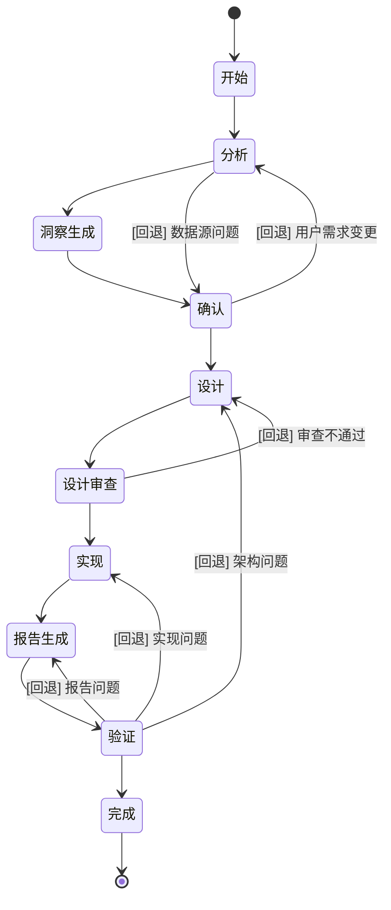

# Conspect Skill 整体智能化升级方案

> **版本**: v2.0  
> **更新日期**: 2026-07-29  
> **目标**: 从"数据 → 图表"升级为"数据 → 图表 + 洞察"双产物模式

---

## 一、升级目标

### 1.1 核心目标

| 维度 | 当前状态 (v1.0) | 升级后 (v2.0) |
|------|----------------|---------------|
| **产出物** | 1 份可视化看板 | 1 份看板 + 1 份深度分析报告 |
| **信息密度** | 可视化为主 | 可视化 + 深度分析 + 行动建议 |
| **受众覆盖** | 管理层 | 管理层 + 分析师 + 执行层 |
| **可交付性** | 需配合讲解 | 报告自解释，可独立阅读 |
| **智能程度** | 图表选型智能 | 图表选型 + 洞察生成 + 建议推荐 |

### 1.2 关键价值点

1. **双产物模式**：同样的数据投入，产出看板和报告两份高价值产物
2. **智能洞察**：基于高级分析结果自动生成业务洞察和行动建议
3. **多格式输出**：支持 Markdown、HTML、PDF、Word 四种格式
4. **关联体验**：看板与报告智能关联，快速定位深入分析

---

## 二、整体架构设计

### 2.1 架构对比

#### 当前架构 (v1.0)

```
┌─────────────────────────────────────────────────────────────┐
│                     数据源 (Excel/CSV)                        │
└─────────────────────────────────────────────────────────────┘
                              │
                              ▼
┌─────────────────────────────────────────────────────────────┐
│                     Analyzer Agent                           │
│  ┌─────────┐  ┌─────────┐  ┌─────────┐  ┌─────────┐       │
│  │数据清洗  │→│维度识别  │→│指标计算  │→│图表推荐  │       │
│  └─────────┘  └─────────┘  └─────────┘  └─────────┘       │
│                                    │                        │
│                                    ▼                        │
│                          ┌─────────────────┐               │
│                          │  高级分析模块    │               │
│                          │ (信息熵/集中度..)│               │
│                          └─────────────────┘               │
└─────────────────────────────────────────────────────────────┘
                              │
                              ▼
┌─────────────────────────────────────────────────────────────┐
│                     Designer Agent                           │
│  ┌─────────┐  ┌─────────┐  ┌─────────┐                    │
│  │图表选型  │→│排版设计  │→│配色方案  │                    │
│  └─────────┘  └─────────┘  └─────────┘                    │
└─────────────────────────────────────────────────────────────┘
                              │
                              ▼
┌─────────────────────────────────────────────────────────────┐
│                    Implementer Agent                         │
│  ┌─────────────────────────────────────────────────────┐   │
│  │              RenderEngine (HTML/PDF)                 │   │
│  │         ┌────────────────────────────────┐          │   │
│  │         │      ECharts 可视化看板         │          │   │
│  │         └────────────────────────────────┘          │   │
│  └─────────────────────────────────────────────────────┘   │
└─────────────────────────────────────────────────────────────┘
                              │
                              ▼
                     ┌─────────────────┐
                     │   产物: 看板     │
                     │  (HTML/PDF/PNG)  │
                     └─────────────────┘
```

#### 升级后架构 (v2.0)

```
┌─────────────────────────────────────────────────────────────┐
│                     数据源 (Excel/CSV)                        │
└─────────────────────────────────────────────────────────────┘
                              │
                              ▼
┌─────────────────────────────────────────────────────────────┐
│                     Analyzer Agent (升级)                     │
│  ┌─────────┐  ┌─────────┐  ┌─────────┐  ┌─────────┐       │
│  │数据清洗  │→│维度识别  │→│指标计算  │→│图表推荐  │       │
│  └─────────┘  └─────────┘  └─────────┘  └─────────┘       │
│                                    │                        │
│                                    ▼                        │
│                          ┌─────────────────┐               │
│                          │  高级分析模块    │               │
│                          │ (信息熵/集中度..)│               │
│                          └────────┬────────┘               │
│                                   │                         │
│                                   ▼                         │
│                          ┌─────────────────┐               │
│                          │ InsightGenerator │ (新增)       │
│                          │  智能洞察生成    │               │
│                          └────────┬────────┘               │
└─────────────────────────────────────────────────────────────┘
                              │
              ┌───────────────┴───────────────┐
              │                               │
              ▼                               ▼
┌─────────────────────────┐     ┌─────────────────────────┐
│    Designer Agent        │     │   ReportDesigner Agent  │ (新增)
│  ┌─────────┐            │     │  ┌─────────────────┐   │
│  │图表选型  │            │     │  │ 报告结构设计     │   │
│  │排版设计  │            │     │  │ 洞察组织        │   │
│  │配色方案  │            │     │  │ 建议生成        │   │
│  └─────────┘            │     │  └─────────────────┘   │
└─────────────────────────┘     └─────────────────────────┘
              │                               │
              ▼                               ▼
┌─────────────────────────┐     ┌─────────────────────────┐
│   Implementer Agent      │     │  ReportImplementer      │ (新增)
│  ┌─────────────────┐   │     │  ┌─────────────────┐   │
│  │ RenderEngine    │   │     │  │ ReportRenderer  │   │
│  │ (HTML/PDF/PNG)  │   │     │  │ (MD/HTML/PDF/   │   │
│  └─────────────────┘   │     │  │  Word)          │   │
└─────────────────────────┘     └─────────────────────────┘
              │                               │
              ▼                               ▼
     ┌─────────────────┐             ┌─────────────────┐
     │   产物: 看板     │             │   产物: 报告     │
     │  (HTML/PDF/PNG)  │             │ (MD/HTML/PDF/   │
     │                  │             │  Word)          │
     └─────────────────┘             └─────────────────┘
              │                               │
              └───────────────┬───────────────┘
                              │
                              ▼
                     ┌─────────────────┐
                     │  关联索引文件    │
                     │ (看板↔报告关联)  │
                     └─────────────────┘
```

### 2.2 新增模块概览

| 模块 | 类型 | 职责 | 依赖 |
|------|------|------|------|
| **InsightGenerator** | 新增工具模块 | 基于高级分析结果生成智能洞察 | 高级分析模块 |
| **ReportDesigner Agent** | 新增Agent | 设计报告结构、组织洞察、生成建议 | Analyzer Agent |
| **ReportImplementer Agent** | 新增Agent | 渲染报告为多格式输出 | ReportDesigner |
| **ReportRenderer** | 新增工具模块 | 渲染报告为 HTML/PDF/Word | 模板引擎 |
| **MultiFormatExporter** | 升级工具模块 | 支持 Markdown/HTML/PDF/Word 导出 | ReportRenderer |

---

## 三、新增模块详细设计

### 3.1 InsightGenerator 智能洞察生成模块

#### 3.1.1 模块定位

`InsightGenerator` 是连接高级分析结果与业务洞察的桥梁，负责将统计学结论转化为可理解的业务语言。

#### 3.1.2 核心类设计

```python
# conspect_tools/insight_generator.py

class InsightGenerator:
    """
    智能洞察生成器
    基于高级分析结果自动生成业务洞察和行动建议
    """
    
    def __init__(self, analysis_result: Dict):
        """
        初始化洞察生成器
        
        参数:
            analysis_result: Analyzer Agent 的分析结果字典
        """
        self.analysis = analysis_result
        self.insights: List[Insight] = []
        self.recommendations: List[Recommendation] = []
    
    def generate_all(self) -> Dict:
        """
        生成所有洞察和建议
        
        返回:
            {
                "executive_summary": str,      # 执行摘要
                "key_findings": List[Insight], # 关键发现
                "risk_alerts": List[Insight],  # 风险预警
                "opportunities": List[Insight],# 机会识别
                "recommendations": List[Recommendation], # 行动建议
                "appendix": Dict               # 附录信息
            }
        """
        pass
    
    def _generate_executive_summary(self) -> str:
        """
        生成执行摘要 (3-5句话概括核心发现)
        
        规则:
        - 包含最重要的 3 个指标及其变化
        - 包含最关键的 1-2 个发现
        - 包含最紧迫的 1 个建议
        """
        pass
    
    def _analyze_concentration_risk(self) -> List[Insight]:
        """
        集中度风险洞察
        
        触发条件: 集中度分析已完成
        输出示例:
        - "Top 3 产品占总销售额的 78.5%，存在较高的产品集中度风险"
        - "建议: 拓展产品线，降低对头部产品的依赖"
        """
        pass
    
    def _analyze_trend_forecast(self) -> List[Insight]:
        """
        趋势预测洞察
        
        触发条件: 趋势预测分析已完成
        输出示例:
        - "基于近 6 个月趋势，下期销售额预测为 1,250,000 元 (95% CI: 1,180,000-1,320,000)"
        - "当前增长趋势强劲 (月均增长 5.2%)，建议加大投入"
        """
        pass
    
    def _analyze_dimension_importance(self) -> List[Insight]:
        """
        维度影响力洞察
        
        触发条件: 信息熵分析已完成
        输出示例:
        - "地区维度对销售额的解释力最强 (互信息占比 45.2%)，建议按地区制定差异化策略"
        """
        pass
    
    def _analyze_anomalies(self) -> List[Insight]:
        """
        异常检测洞察
        
        触发条件: 异常检测已完成
        输出示例:
        - "2024年3月销售额异常增长 156%，经核查为促销活动影响，非正常增长"
        """
        pass
    
    def _analyze_distribution(self) -> List[Insight]:
        """
        分布形态洞察
        
        触发条件: 分布形态分析已完成
        输出示例:
        - "销售额呈右偏分布 (偏度 1.85)，少数高价值客户贡献了大部分收入"
        """
        pass
    
    def _generate_recommendations(self) -> List[Recommendation]:
        """
        生成行动建议
        
        规则:
        - 每条建议必须关联至少一个数据发现
        - 按优先级排序 (高/中/低)
        - 包含具体的、可执行的动作
        """
        pass


class Insight:
    """单条洞察"""
    
    def __init__(self, 
                 category: str,        # 类别: finding/risk/opportunity
                 title: str,           # 标题
                 description: str,     # 描述
                 evidence: str,        # 数据证据
                 severity: str = "info",  # 严重程度: info/warning/critical
                 related_metrics: List[str] = None):
        self.category = category
        self.title = title
        self.description = description
        self.evidence = evidence
        self.severity = severity
        self.related_metrics = related_metrics or []
    
    def to_markdown(self) -> str:
        """转为 Markdown 格式"""
        severity_icon = {
            "info": "[信息]",
            "warning": "[警告]",
            "critical": "[严重]"
        }
        return f"""**{severity_icon.get(self.severity, '')} {self.title}**

{self.description}

> 数据依据: {self.evidence}
"""


class Recommendation:
    """单条建议"""
    
    def __init__(self,
                 title: str,           # 建议标题
                 description: str,     # 建议描述
                 priority: str,        # 优先级: high/medium/low
                 expected_impact: str, # 预期效果
                 related_findings: List[str] = None):
        self.title = title
        self.description = description
        self.priority = priority
        self.expected_impact = expected_impact
        self.related_findings = related_findings or []
    
    def to_markdown(self) -> str:
        """转为 Markdown 格式"""
        priority_icon = {
            "high": "[高优先级]",
            "medium": "[中优先级]",
            "low": "[低优先级]"
        }
        return f"""**{priority_icon.get(self.priority, '')} {self.title}**

{self.description}

> 预期效果: {self.expected_impact}
"""
```

#### 3.1.3 洞察生成规则

| 分析模块 | 触发条件 | 洞察类型 | 输出内容 |
|---------|---------|---------|---------|
| 信息熵分析 | 已完成 | 维度影响力 | 各维度对指标的解释力排行 |
| 集中度分析 | CR4 > 60% | 风险预警 | 集中度风险提示 |
| 趋势预测 | 趋势强度 > 5% | 趋势洞察 | 趋势方向、预测值 |
| 异常检测 | 发现异常点 | 异常预警 | 异常时间点、可能原因 |
| 分布形态 | \|偏度\| > 1 | 分布洞察 | 分布特征、业务含义 |
| 贪心优化 | 已完成 | 优化建议 | 最优资源配置方案 |

---

### 3.2 ReportDesigner Agent

#### 3.2.1 Agent 定义

```markdown
# 07. 报告设计 Agent（ReportDesigner Agent）

## 角色定位

你是 conspect Skill 的**报告设计师 Agent**。你的职责是基于分析结果和智能洞察，设计报告结构，组织内容，生成专业的数据分析报告。

## 启动条件

- Analyzer Agent 已完成分析
- InsightGenerator 已生成洞察
- 接力棒状态为 "设计"

## 职责

1. **报告结构设计**
   - 根据数据特征选择最合适的报告模板
   - 组织报告章节结构
   - 确定各章节内容来源

2. **内容组织**
   - 将分析结果转化为报告语言
   - 组织洞察和建议的呈现顺序
   - 设计图表与文字的配合方式

3. **报告风格控制**
   - 确保报告语言专业、客观
   - 控制报告长度适中（执行摘要 1 页，完整报告 5-10 页）
   - 确保格式规范统一

## 输出产物

- `_cs-report-design.md` - 报告设计文档
```

#### 3.2.2 报告模板选择规则

| 数据特征 | 推荐模板 | 说明 |
|---------|---------|------|
| 单维度时间序列 | 趋势分析报告 | 重点展示趋势变化和预测 |
| 多维度对比 | 对比分析报告 | 重点展示各维度差异 |
| 构成占比 | 结构分析报告 | 重点展示构成和集中度 |
| 多指标关联 | 关联分析报告 | 重点展示指标间关系 |
| 综合数据 | 综合分析报告 | 完整的多角度分析 |

---

### 3.3 ReportRenderer 报告渲染引擎

#### 3.3.1 核心类设计

```python
# conspect_tools/report_renderer.py

class ReportRenderer:
    """
    报告渲染引擎
    将报告设计渲染为多种格式输出
    """
    
    def __init__(self, theme_name: str = "ocean"):
        """
        初始化报告渲染引擎
        
        参数:
            theme_name: 配色主题名称
        """
        self.theme = ColorTheme.get(theme_name)
        self.template_engine = TemplateEngine()
    
    def render_markdown(self, report_design: Dict) -> str:
        """
        渲染为 Markdown 格式
        
        参数:
            report_design: 报告设计字典
            
        返回:
            Markdown 字符串
        """
        sections = [
            self._render_header(report_design),
            self._render_executive_summary(report_design),
            self._render_data_overview(report_design),
            self._render_key_findings(report_design),
            self._render_advanced_analysis(report_design),
            self._render_recommendations(report_design),
            self._render_appendix(report_design)
        ]
        return "\n\n---\n\n".join(sections)
    
    def render_html(self, report_design: Dict) -> str:
        """
        渲染为 HTML 格式（独立文件，可离线阅读）
        
        特点:
        - 内联所有 CSS 样式
        - 支持目录导航
        - 支持图表嵌入（Base64）
        - 支持打印优化
        """
        md_content = self.render_markdown(report_design)
        html = self._md_to_html(md_content)
        return self._wrap_html_template(html, report_design.get("title", "数据分析报告"))
    
    def render_pdf(self, report_design: Dict) -> bytes:
        """
        渲染为 PDF 格式
        
        实现: 通过 Playwright 无头浏览器打开 HTML，截图输出 PDF
        """
        html = self.render_html(report_design)
        return self._html_to_pdf(html)
    
    def render_word(self, report_design: Dict) -> bytes:
        """
        渲染为 Word 格式 (.docx)
        
        实现: 使用 python-docx 库生成
        """
        pass
    
    def _render_header(self, design: Dict) -> str:
        """渲染报告头部"""
        return f"""# {design.get('title', '数据分析报告')}

> **生成时间**: {design.get('generated_at', '')}  
> **数据来源**: {design.get('data_source', '')}  
> **数据范围**: {design.get('data_range', '')}
"""
    
    def _render_executive_summary(self, design: Dict) -> str:
        """渲染执行摘要"""
        summary = design.get("executive_summary", "")
        kpis = design.get("kpis", [])
        
        kpi_text = "\n".join([
            f"| {kpi.get('label', '')} | {kpi.get('value', '')} | {kpi.get('change', '')} |"
            for kpi in kpis
        ])
        
        return f"""## 执行摘要

{summary}

### 关键指标

| 指标 | 数值 | 变化 |
|------|------|------|
{kpi_text}
"""
    
    def _render_key_findings(self, design: Dict) -> str:
        """渲染关键发现"""
        findings = design.get("key_findings", [])
        sections = []
        
        for finding in findings:
            sections.append(finding.to_markdown())
        
        return "## 关键发现\n\n" + "\n\n".join(sections)
    
    def _render_recommendations(self, design: Dict) -> str:
        """渲染行动建议"""
        recommendations = design.get("recommendations", [])
        
        # 按优先级排序
        priority_order = {"high": 0, "medium": 1, "low": 2}
        recommendations.sort(key=lambda x: priority_order.get(x.priority, 3))
        
        sections = []
        for rec in recommendations:
            sections.append(rec.to_markdown())
        
        return "## 行动建议\n\n" + "\n\n".join(sections)
    
    def _md_to_html(self, md_content: str) -> str:
        """Markdown 转 HTML"""
        # 使用 markdown 库转换
        import markdown
        return markdown.markdown(md_content, extensions=['tables', 'fenced_code'])
    
    def _wrap_html_template(self, content: str, title: str) -> str:
        """包装为完整 HTML 页面"""
        return f"""<!DOCTYPE html>
<html lang="zh-CN">
<head>
    <meta charset="UTF-8">
    <meta name="viewport" content="width=device-width, initial-scale=1.0">
    <title>{title}</title>
    <style>
        /* 报告专用样式 */
        body {{
            font-family: 'PingFang SC', 'Microsoft YaHei', -apple-system, sans-serif;
            line-height: 1.8;
            color: #333;
            max-width: 900px;
            margin: 0 auto;
            padding: 40px 20px;
        }}
        h1 {{ color: #2B5F8A; border-bottom: 2px solid #2B5F8A; padding-bottom: 10px; }}
        h2 {{ color: #2B5F8A; margin-top: 40px; }}
        h3 {{ color: #4A9BD9; }}
        table {{ border-collapse: collapse; width: 100%; margin: 20px 0; }}
        th, td {{ border: 1px solid #ddd; padding: 12px; text-align: left; }}
        th {{ background-color: #f5f5f5; }}
        blockquote {{ border-left: 4px solid #2B5F8A; padding-left: 16px; color: #666; }}
        .severity-info {{ color: #4A9BD9; }}
        .severity-warning {{ color: #E8856B; }}
        .severity-critical {{ color: #D32F2F; }}
        @media print {{
            body {{ padding: 0; }}
            .no-print {{ display: none; }}
        }}
    </style>
</head>
<body>
    {content}
</body>
</html>"""
```

---

### 3.4 Analyzer Agent 升级方案

#### 3.4.1 升级内容

| 升级项 | 当前 | 升级后 |
|--------|------|--------|
| **输出格式** | `_cs-analysis.md` (中间产物) | `_cs-analysis.md` (增强版) + `_cs-insights.json` (洞察数据) |
| **执行摘要** | 无 | 新增执行摘要章节 |
| **高级分析** | 仅输出统计结果 | 增加业务解读 |
| **建议生成** | 无 | 新增初步建议 |

#### 3.4.2 升级后的 `_cs-analysis.md` 结构

```markdown
# 数据分析报告

## 0. 执行摘要 (新增)

本报告基于 [数据范围] 的 [数据量] 条记录进行分析，主要发现如下：

1. **[核心指标1]** 达到 [数值]，[同比/环比] [变化方向] [变化幅度]%
2. **[核心指标2]** [关键发现]
3. **[核心指标3]** [关键发现]

**关键建议**: [最紧迫的 1-2 条建议]

---

## 1. 数据概览
[保持不变]

## 2. 数据清洗记录
[保持不变]

## 3. 多角度多层次分析
[保持不变]

## 4. 指标分析
[保持不变]

## 5. 高级分析
[保持不变，增加业务解读]

## 6. 图表推荐方案
[保持不变]

## 7. 数据洞察摘要
[保持不变]

## 8. 初步建议 (新增)

基于以上分析，提出以下初步建议：

### 高优先级
- [建议 1]
- [建议 2]

### 中优先级
- [建议 3]

## 9. 分析假设与方法说明
[保持不变]
```

---

### 3.5 多格式导出模块升级

#### 3.5.1 升级后的 Exporter 类

```python
# conspect_tools/exporter.py (升级)

class Exporter:
    """多格式文件导出器"""
    
    def __init__(self, output_dir: Optional[str] = None):
        self.output_dir = Path(output_dir) if output_dir else Path.cwd() / "output"
        self.output_dir.mkdir(parents=True, exist_ok=True)
        self.report_dir = self.output_dir / "reports"
        self.report_dir.mkdir(exist_ok=True)
    
    # ===== 看板导出 (已有) =====
    
    def save_html(self, content: str, filename: str = "dashboard.html") -> str:
        """保存看板 HTML"""
        filepath = self.output_dir / filename
        filepath.write_text(content, encoding="utf-8")
        return str(filepath)
    
    def save_pdf(self, content: bytes, filename: str = "dashboard.pdf") -> str:
        """保存看板 PDF"""
        filepath = self.output_dir / filename
        filepath.write_bytes(content)
        return str(filepath)
    
    def save_png(self, content: bytes, filename: str = "dashboard.png") -> str:
        """保存看板 PNG"""
        filepath = self.output_dir / filename
        filepath.write_bytes(content)
        return str(filepath)
    
    # ===== 报告导出 (新增) =====
    
    def save_report_markdown(self, content: str, filename: str = "report.md") -> str:
        """
        保存报告为 Markdown 格式
        
        适用场景:
        - 技术团队内部传阅
        - 版本管理系统
        - 需要二次编辑
        """
        filepath = self.report_dir / filename
        filepath.write_text(content, encoding="utf-8")
        return str(filepath)
    
    def save_report_html(self, content: str, filename: str = "report.html") -> str:
        """
        保存报告为 HTML 格式
        
        特点:
        - 独立文件，可离线阅读
        - 支持目录导航
        - 支持打印优化
        """
        filepath = self.report_dir / filename
        filepath.write_text(content, encoding="utf-8")
        return str(filepath)
    
    def save_report_pdf(self, content: bytes, filename: str = "report.pdf") -> str:
        """
        保存报告为 PDF 格式
        
        适用场景:
        - 正式汇报
        - 打印归档
        - 邮件发送
        """
        filepath = self.report_dir / filename
        filepath.write_bytes(content)
        return str(filepath)
    
    def save_report_word(self, content: bytes, filename: str = "report.docx") -> str:
        """
        保存报告为 Word 格式
        
        适用场景:
        - 需要二次编辑
        - 领导批注
        - 模板套用
        """
        filepath = self.report_dir / filename
        filepath.write_bytes(content)
        return str(filepath)
    
    # ===== 关联索引 (新增) =====
    
    def save_index(self, index: Dict, filename: str = "_cs-index.json") -> str:
        """
        保存看板与报告的关联索引
        
        索引结构:
        {
            "dashboard": "reports/dashboard.html",
            "reports": {
                "markdown": "reports/report.md",
                "html": "reports/report.html",
                "pdf": "reports/report.pdf",
                "word": "reports/report.docx"
            },
            "sections": {
                "executive_summary": {"dashboard": "kpi-section", "report": "section-0"},
                "trend_analysis": {"dashboard": "chart-1", "report": "section-3.1"},
                ...
            }
        }
        """
        import json
        filepath = self.output_dir / filename
        filepath.write_text(json.dumps(index, ensure_ascii=False, indent=2), encoding="utf-8")
        return str(filepath)
```

---

## 四、状态机调整方案

### 4.1 状态机对比

#### 当前状态机 (v1.0)

```
开始 → 分析 → 确认 → 设计 → 设计审查 → 实现 → 验证 → 完成
```

#### 升级后状态机 (v2.0)

```
开始 → 分析 → 洞察生成 → 确认 → 设计 → 设计审查 → 实现 → 报告生成 → 验证 → 完成
```

### 4.2 新增状态说明

| 状态 | 中文名 | 自动推进 | 用户介入 | 说明 |
|------|--------|---------|---------|------|
| INSIGHT | 洞察生成 | [自动] | — | 基于分析结果生成智能洞察 |
| REPORT | 报告生成 | [自动] | — | 渲染报告为多格式输出 |

### 4.3 状态流转图



---

## 五、产物文件清单

### 5.1 新增产物文件

| 文件 | 说明 | 生成阶段 | 格式 |
|------|------|---------|------|
| `_cs-insights.json` | 智能洞察数据 | 洞察生成 | JSON |
| `_cs-report-design.md` | 报告设计文档 | 设计 | Markdown |
| `_cs-report.md` | 分析报告 (Markdown) | 报告生成 | Markdown |
| `_cs-report.html` | 分析报告 (HTML) | 报告生成 | HTML |
| `_cs-report.pdf` | 分析报告 (PDF) | 报告生成 | PDF |
| `_cs-report.docx` | 分析报告 (Word) | 报告生成 | Word |
| `_cs-index.json` | 关联索引 | 报告生成 | JSON |

### 5.2 产物目录结构

```
.agent/harness/
├── _cs-baton.md              # 接力棒
├── _cs-analysis.md           # 数据分析报告 (分析阶段)
├── _cs-insights.json         # 智能洞察数据 (洞察生成阶段) [新增]
├── _cs-qa-analysis.md        # 分析质量审核
├── _cs-design.md             # 图表设计文档
├── _cs-report-design.md      # 报告设计文档 [新增]
├── _cs-design-review.md      # 设计审查意见
├── _cs-implement.md          # 实现摘要
├── _cs-qa-implement.md       # 实现质量审核
├── _cs-report.md             # 分析报告 Markdown [新增]
├── _cs-qa-report.md          # 报告质量审核 [新增]
├── _cs-verify.md             # 验证报告
└── _cs-index.json            # 关联索引 [新增]

output/
├── dashboard.html            # 看板 HTML
├── dashboard.pdf             # 看板 PDF
├── dashboard.png             # 看板 PNG
└── reports/
    ├── report.md             # 报告 Markdown
    ├── report.html           # 报告 HTML
    ├── report.pdf            # 报告 PDF
    └── report.docx           # 报告 Word
```

---

## 六、实现步骤与时间规划

### 6.1 分阶段实施

#### 阶段一：核心功能实现 (3-5 天)

**目标**: 实现"看板 + 报告"双产物基本能力

| 任务 | 负责人 | 预计工时 | 产出 |
|------|--------|---------|------|
| 实现 InsightGenerator 核心类 | 开发 | 1 天 | `insight_generator.py` |
| 升级 Analyzer Agent 输出格式 | 开发 | 0.5 天 | 更新 `01-analyzer-agent.md` |
| 实现 ReportRenderer 基础渲染 | 开发 | 1 天 | `report_renderer.py` |
| 升级 Exporter 支持报告导出 | 开发 | 0.5 天 | 更新 `exporter.py` |
| 新增 ReportDesigner Agent | 开发 | 0.5 天 | `07-report-designer-agent.md` |
| 新增 ReportImplementer Agent | 开发 | 0.5 天 | `08-report-implementer-agent.md` |
| 状态机调整 | 开发 | 0.5 天 | 更新 `SKILL.md` |
| 集成测试 | 测试 | 0.5 天 | 测试报告 |

#### 阶段二：增强功能 (3-4 天)

**目标**: 提升报告质量和用户体验

| 任务 | 负责人 | 预计工时 | 产出 |
|------|--------|---------|------|
| 实现 Word 导出 | 开发 | 1 天 | `report_renderer.py` 更新 |
| 实现 PDF 导出优化 | 开发 | 0.5 天 | 优化渲染引擎 |
| 实现看板-报告关联 | 开发 | 1 天 | 关联索引功能 |
| 报告模板优化 | 设计 | 1 天 | 多套报告模板 |
| 洞察规则优化 | 开发 | 0.5 天 | 更新洞察生成规则 |

#### 阶段三：智能化升级 (2-3 天)

**目标**: 提升自动化和智能化水平

| 任务 | 负责人 | 预计工时 | 产出 |
|------|--------|---------|------|
| 自适应报告模板选择 | 开发 | 1 天 | 模板选择算法 |
| 历史对比分析 | 开发 | 1 天 | 历史数据对比功能 |
| 智能建议优化 | 开发 | 0.5 天 | 建议生成优化 |
| 端到端测试 | 测试 | 0.5 天 | 完整测试报告 |

### 6.2 总时间估算

| 阶段 | 时间 | 累计 |
|------|------|------|
| 阶段一：核心功能 | 3-5 天 | 3-5 天 |
| 阶段二：增强功能 | 3-4 天 | 6-9 天 |
| 阶段三：智能化 | 2-3 天 | 8-12 天 |
| **总计** | **8-12 天** | — |

---

## 七、技术依赖

### 7.1 新增 Python 依赖

```txt
# requirements.txt (新增)

# Markdown 处理
markdown>=3.5.0

# Word 文档生成
python-docx>=1.1.0

# PDF 生成 (已有 Playwright)
# playwright>=1.40.0

# 模板引擎 (可选，用于复杂报告模板)
# jinja2>=3.1.0
```

### 7.2 依赖安装命令

```bash
pip install markdown python-docx
```

---

## 八、质量保证

### 8.1 测试策略

| 测试类型 | 测试内容 | 通过标准 |
|---------|---------|---------|
| 单元测试 | InsightGenerator 各方法 | 100% 覆盖率 |
| 单元测试 | ReportRenderer 各格式输出 | 100% 覆盖率 |
| 集成测试 | 完整流程端到端 | 双产物正确生成 |
| 格式测试 | 各格式文件可正常打开 | 无报错 |
| 内容测试 | 洞察准确性 | 与原始数据一致 |

### 8.2 质量检查点

| 阶段 | 检查项 | 检查方式 |
|------|--------|---------|
| 洞察生成 | 洞察与数据一致性 | 自动验证 |
| 报告生成 | 报告格式正确性 | 自动验证 |
| 报告生成 | 数据与看板一致性 | 自动验证 |
| 多格式导出 | 文件可正常打开 | 自动验证 |

---

## 九、风险与应对

| 风险 | 影响 | 应对措施 |
|------|------|---------|
| 报告内容过长 | 用户阅读疲劳 | 执行摘要 + 分页 + 目录导航 |
| 洞察不准确 | 误导决策 | 标注置信度 + 数据依据 |
| 多格式导出失败 | 用户体验降级 | 格式降级策略 (Word → PDF → HTML) |
| 渲染性能问题 | 生成时间过长 | 异步生成 + 进度提示 |

---

## 十、验收标准

### 10.1 功能验收

- [ ] 每次分析同时生成看板和报告
- [ ] 报告包含执行摘要、关键发现、行动建议
- [ ] 支持 Markdown、HTML、PDF、Word 四种格式
- [ ] 看板与报告可相互跳转
- [ ] 洞察基于数据自动生成

### 10.2 质量验收

- [ ] 报告数据与看板数据 100% 一致
- [ ] 洞察有明确的数据依据
- [ ] 建议具体可执行
- [ ] 格式规范统一

### 10.3 性能验收

- [ ] 报告生成时间 < 30 秒 (1 万行数据)
- [ ] 多格式导出总时间 < 60 秒

---

## 十一、后续优化方向

### 11.1 短期优化 (1-2 个月)

1. **报告模板库**: 积累行业报告模板，支持一键套用
2. **历史对比**: 自动对比历史分析结果，识别变化趋势
3. **协作功能**: 支持报告评论、批注、分享

### 11.2 中期优化 (3-6 个月)

1. **自然语言查询**: 用户可用自然语言查询报告内容
2. **自动更新**: 数据更新后自动重新生成报告
3. **个性化推荐**: 根据用户角色推荐关注重点

### 11.3 长期优化 (6-12 个月)

1. **预测分析**: 基于历史数据预测未来趋势
2. **异常预警**: 自动监测数据异常并预警
3. **决策支持**: 基于分析结果推荐最优决策

---

## 附录

### A. 术语表

| 术语 | 说明 |
|------|------|
| 执行摘要 | 报告开头的概要部分，用 3-5 句话概括核心发现 |
| 洞察 | 基于数据分析得出的有价值发现 |
| 建议 | 基于洞察提出的可执行行动方案 |
| 关联索引 | 看板与报告之间的映射关系 |

### B. 参考文档

- [Analyzer Agent](agents/01-analyzer-agent.md)
- [Render Engine](conspect_tools/render_engine.py)
- [Data Pipeline](SKILL.chunks/chunk-03-data-pipeline.md)
